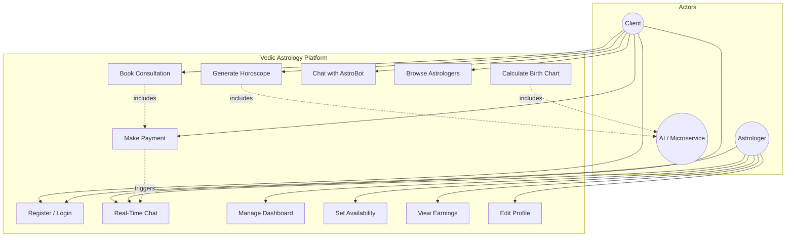
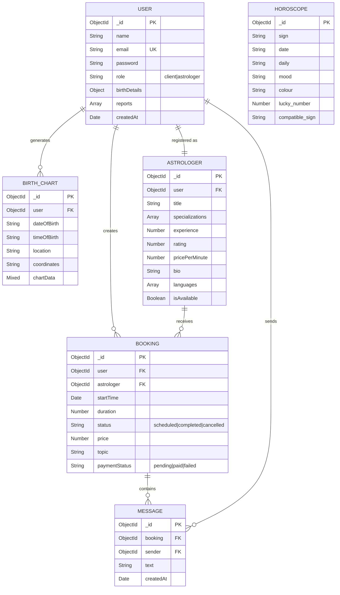
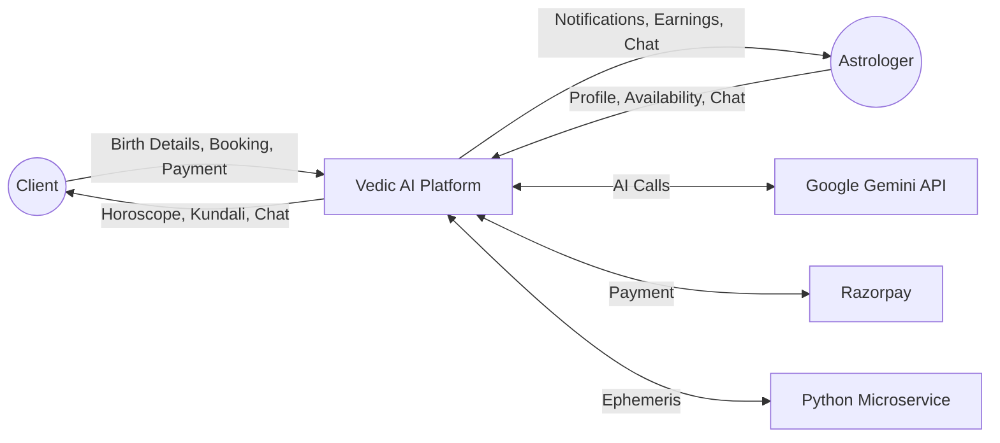
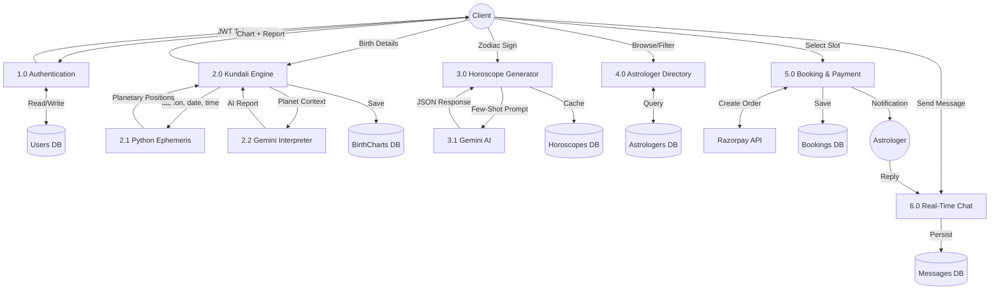
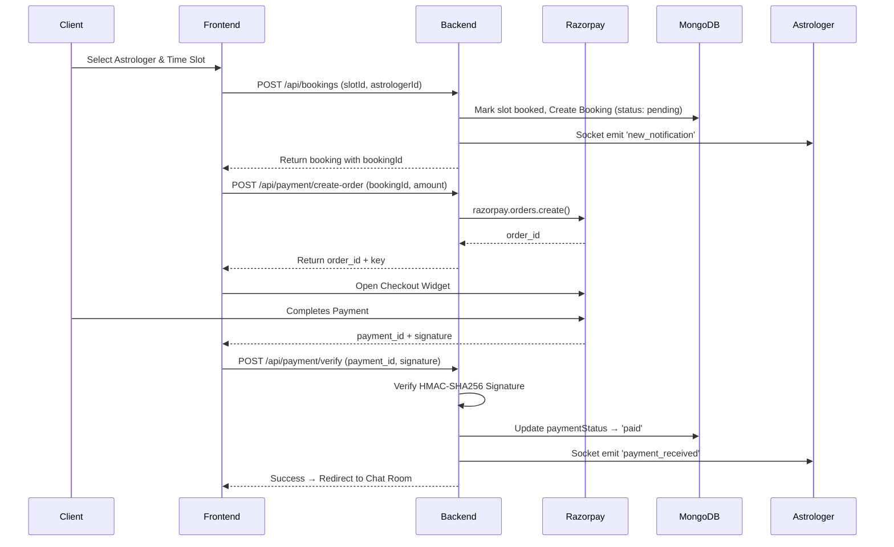
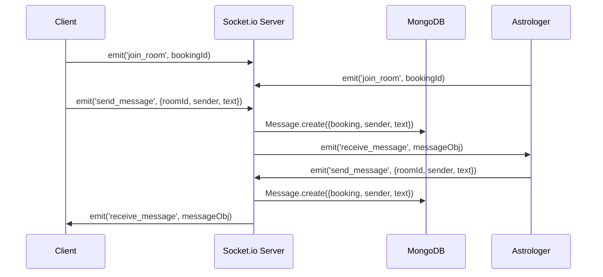
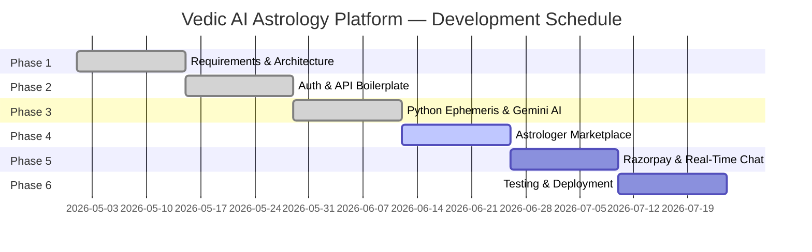

# Capstone Project-1 Report

**Project Title:** Vedic AI Astrology & Real-Time Consultation Platform  
**Technology Stack:** MERN (MongoDB, Express.js, React.js, Node.js) + Python Flask Microservice  

---

# 1. Introduction

## 1.1 Objective of the Project

The objective is to build a full-stack web platform that combines ancient Vedic astrology with modern AI and real-time communication. The system delivers:

1. **AI-Powered Horoscopes & Kundali** — Using Swiss Ephemeris (Python) for precise planetary calculations and Google Gemini AI for natural-language interpretation.
2. **Expert Consultation Marketplace** — A real-time chat system (Socket.io) connecting clients with verified astrologers, backed by Razorpay payment processing.
3. **Astrologer Business Tools** — Dashboard with earnings analytics, availability management, booking lifecycle, and notification systems.

## 1.2 Description of the Project

The platform is a responsive single-page application with role-based access for two user types: **Client** and **Astrologer**.

**Existing Modules (Built):**

| Module | Description | Tech Used |
|--------|-------------|-----------|
| Authentication | JWT-based login/register with bcrypt password hashing, role-based access control | Express, JWT, bcrypt |
| AI Horoscope Engine | Few-shot prompted daily horoscope generation per zodiac sign, cached in MongoDB | Gemini 2.5 Flash, Kaggle dataset |
| Kundali / Birth Chart | Swiss Ephemeris calculates Navagraha positions; Gemini generates interpretation report | Python Flask, pyswisseph, Gemini AI |
| AstroBot Chat | Streaming AI chatbot with birth-detail interception and planetary context injection | Socket.io, Gemini Streaming |
| Astrologer Directory | Public listing with specializations, ratings, pricing, languages | React, Express REST API |
| Booking System | Slot-based scheduling, status lifecycle (scheduled → completed → cancelled) | MongoDB, Express |
| Astrologer Dashboard | Stats (total bookings, today's sessions, earnings), availability management, profile editing | React, Recharts, REST API |
| Blog & Content | Static blog pages with article rendering | React Router |
| Zodiac Compatibility | AI-generated compatibility analysis between two signs | Gemini AI |

**Modules To Be Added:**

| Module | Description | Tech Required |
|--------|-------------|---------------|
| Razorpay Payment Gateway | Order creation, checkout widget, server-side signature verification | `razorpay` npm, Razorpay JS SDK |
| Real-Time Astrologer Chat | Direct bidirectional messaging between client and astrologer post-payment | Socket.io rooms, MongoDB persistence |
| Astrologer Notifications | Live push notifications on dashboard for new bookings and payments | Socket.io events |
| Chat Session Management | Timer-based or manual session end, chat history retrieval | REST + WebSocket |

## 1.3 Scope of the Project

**In-Scope:**
- User registration with role selection (client / astrologer)
- AI-generated daily horoscopes using few-shot prompting
- Precise Kundali generation via Swiss Ephemeris + Gemini AI interpretation
- Astrologer marketplace (browse, filter, book)
- Razorpay payment integration for consultations
- Real-time text chat between client and astrologer
- Astrologer dashboard (earnings, bookings, availability, profile)
- Blog content module

**Out-of-Scope (Future):**
- Video/Audio calling (WebRTC)
- Native mobile applications
- Multi-lingual AI generation beyond English/Hindi
- Admin panel for platform management

### 1.3.1 Use Case Diagram

---

# 2. System Description

## 2.1 Customer / User Profiles

**Profile 1 — Client (End-User):**
- Individuals aged 18–65 interested in astrology, horoscopes, and personal guidance
- Technical expertise: Novice to Intermediate
- Goals: Obtain accurate readings, understand birth charts, consult human astrologers for life events

**Profile 2 — Astrologer (Service Provider):**
- Certified Vedic astrology practitioners
- Technical expertise: Novice — requires a simple, intuitive dashboard
- Goals: Monetize expertise, manage schedule, communicate with clients, track earnings

## 2.2 Assumptions and Dependencies

**Assumptions:**
- Users have stable internet access and a modern browser
- Users possess valid payment methods supported by Razorpay (UPI, cards, wallets)
- Astrologers respond to consultations within stipulated time frames
- Birth time accuracy is the user's responsibility

**Dependencies:**

| Dependency | Purpose | Impact if Unavailable |
|------------|---------|----------------------|
| Google Gemini API | AI horoscope & Kundali interpretation | Fallback to deterministic responses |
| Razorpay API | Payment processing | Bookings cannot be confirmed |
| Swiss Ephemeris (pyswisseph) | Planetary position calculations | Birth chart generation fails |
| MongoDB Atlas | Data storage | Entire application non-functional |
| Nominatim / OpenStreetMap | Geocoding birth locations | Defaults to Delhi coordinates |

## 2.3 Functional Requirements

| ID | Module | Requirement | Priority |
|----|--------|-------------|----------|
| FR-01 | Auth | System shall allow registration as Client or Astrologer with email/password | High |
| FR-02 | Auth | System shall issue JWT tokens (30-day expiry) and enforce role-based route protection | High |
| FR-03 | Horoscope | System shall generate daily AI horoscope per zodiac sign using few-shot prompting from dataset | High |
| FR-04 | Horoscope | System shall cache generated horoscopes in MongoDB to avoid redundant API calls | Medium |
| FR-05 | Kundali | System shall accept birth details (date, time, place) and geocode location to coordinates | High |
| FR-06 | Kundali | System shall call Python microservice to compute Navagraha positions via Swiss Ephemeris | High |
| FR-07 | Kundali | System shall pass planetary data to Gemini AI for personalized Kundali interpretation | High |
| FR-08 | AstroBot | System shall provide a streaming AI chatbot that detects birth details and injects planetary context | Medium |
| FR-09 | Directory | System shall display astrologer list with specializations, pricing, ratings, and availability | High |
| FR-10 | Booking | Clients shall select time slots and create booking requests linked to specific astrologers | High |
| FR-11 | Payment | System shall create Razorpay orders and verify payment signatures server-side | High |
| FR-12 | Chat | Upon payment confirmation, system shall open a WebSocket room for real-time messaging | High |
| FR-13 | Chat | System shall persist all consultation messages to MongoDB | Medium |
| FR-14 | Dashboard | Astrologers shall view total bookings, today's sessions, earnings, and unread messages | Medium |
| FR-15 | Dashboard | Astrologers shall manage availability slots and edit professional profile | Medium |
| FR-16 | Compatibility | System shall generate AI-based zodiac compatibility analysis between two signs | Low |
| FR-17 | Notifications | Astrologers shall receive real-time Socket.io notifications for new bookings and payments | High |

## 2.4 Non-Functional Requirements

| ID | Category | Requirement |
|----|----------|-------------|
| NFR-01 | Performance | AI horoscope generation shall complete within 5 seconds including API round-trip |
| NFR-02 | Performance | WebSocket message delivery latency shall not exceed 200ms under 1000 concurrent rooms |
| NFR-03 | Security | All protected API endpoints shall require valid JWT Bearer token |
| NFR-04 | Security | Passwords shall be hashed with bcrypt (work factor 10) before storage |
| NFR-05 | Security | No credit card data shall be stored on the server; PCI compliance offloaded to Razorpay |
| NFR-06 | Reliability | Gemini AI failures shall gracefully fallback to deterministic keyword-based responses |
| NFR-07 | Reliability | Multiple Gemini model fallback chain (gemini-2.5-flash → gemini-2.0-flash-lite → gemini-2.0-flash) |
| NFR-08 | Usability | UI shall be fully responsive across desktop, tablet, and mobile viewports |
| NFR-09 | Scalability | Stateless JWT auth enables horizontal scaling without session affinity |

---

# 3. Design

## 3.1 System Design

### 3.1.1 Entity-Relationship (E-R) Diagram

### 3.1.2 Data Flow Diagrams (DFDs)

**Level 0 — Context Diagram:**

**Level 1 — Process Decomposition:**

**Level 2 — Booking & Payment Sub-Process:**

**Level 2 — Real-Time Chat Sub-Process:**

## 3.2 Database Design

**MongoDB Collections — Data Dictionary:**

### Table 1: Users

| Field | Type | Description | Constraints |
|-------|------|-------------|-------------|
| `_id` | ObjectId | Primary Key | Auto-generated |
| `name` | String | User's full name | Required |
| `email` | String | Login email | Required, Unique |
| `password` | String | bcrypt hashed password | Required |
| `role` | String | User type | Enum: `client`, `astrologer` |
| `birthDetails.date` | Date | Date of birth | Optional |
| `birthDetails.time` | String | Time of birth | Optional |
| `birthDetails.place` | String | Place of birth | Optional |
| `reports` | Array | Saved report references | Optional |
| `createdAt` | Date | Registration timestamp | Auto (Mongoose) |

### Table 2: Astrologers

| Field | Type | Description | Constraints |
|-------|------|-------------|-------------|
| `_id` | ObjectId | Primary Key | Auto-generated |
| `user` | ObjectId | FK → Users | Required, Ref: User |
| `title` | String | Professional title | Required |
| `specializations` | [String] | Expertise areas | Required |
| `experience` | Number | Years of experience | Required |
| `rating` | Number | Average rating | Default: 5.0 |
| `totalConsultations` | Number | Completed sessions count | Default: 0 |
| `pricePerMinute` | Number | Consultation rate (₹) | Required |
| `bio` | String | Professional biography | Required |
| `languages` | [String] | Spoken languages | Required |
| `isAvailable` | Boolean | Online status | Default: true |

### Table 3: Bookings

| Field | Type | Description | Constraints |
|-------|------|-------------|-------------|
| `_id` | ObjectId | Primary Key | Auto-generated |
| `user` | ObjectId | FK → Users (client) | Required |
| `astrologer` | ObjectId | FK → Astrologers | Required |
| `startTime` | Date | Scheduled consultation time | Required |
| `duration` | Number | Session length in minutes | Required |
| `status` | String | Lifecycle stage | Enum: `scheduled`, `completed`, `cancelled` |
| `price` | Number | Total consultation price (₹) | Required |
| `topic` | String | Consultation topic | Default: "General Consultation" |
| `paymentStatus` | String | Payment state | Enum: `pending`, `paid`, `failed` |

### Table 4: Messages

| Field | Type | Description | Constraints |
|-------|------|-------------|-------------|
| `_id` | ObjectId | Primary Key | Auto-generated |
| `booking` | ObjectId | FK → Bookings (chat room) | Required |
| `sender` | ObjectId | FK → Users (who sent) | Required |
| `text` | String | Message content | Required |
| `createdAt` | Date | Send timestamp | Auto (Mongoose) |

### Table 5: BirthCharts

| Field | Type | Description | Constraints |
|-------|------|-------------|-------------|
| `_id` | ObjectId | Primary Key | Auto-generated |
| `user` | ObjectId | FK → Users | Optional |
| `dateOfBirth` | String | Birth date (YYYY-MM-DD) | Required |
| `timeOfBirth` | String | Birth time (HH:MM) | Required |
| `location` | String | Birth place name | Required |
| `coordinates` | String | Geocoded lat,lon | Required |
| `chartData` | Mixed | Full chart JSON (planets, houses, interpretations) | Required |

### Table 6: Horoscopes

| Field | Type | Description | Constraints |
|-------|------|-------------|-------------|
| `_id` | ObjectId | Primary Key | Auto-generated |
| `sign` | String | Zodiac sign name | Required, Indexed |
| `date` | String | Generation date (YYYY-MM-DD) | Required, Indexed |
| `daily` | String | AI-generated horoscope text | Required |
| `mood` | String | Predicted mood | Required |
| `colour` | String | Lucky colour | Required |
| `lucky_number` | Number | Lucky number (10–99) | Required |
| `compatible_sign` | String | Most compatible sign | Required |

---

### Complete REST API Endpoint Reference

| Method | Endpoint | Auth | Role | Description |
|--------|----------|------|------|-------------|
| POST | `/api/auth/register` | No | — | Register new user |
| POST | `/api/auth/login` | No | — | Login, receive JWT |
| GET | `/api/users/profile` | Yes | Any | Get user profile |
| PUT | `/api/users/profile` | Yes | Any | Update profile & birth details |
| GET | `/api/users/birth-details` | Yes | Any | Get saved birth details |
| GET | `/api/users/reports` | Yes | Any | Get saved reports |
| GET | `/api/users/chats` | Yes | Any | Get chat history list |
| GET | `/api/astro/horoscope/:sign` | No | — | AI daily horoscope for sign |
| POST | `/api/astro/compatibility` | No | — | AI compatibility analysis |
| POST | `/api/astro/birth-chart` | No | — | Generate Kundali chart |
| GET | `/api/astrologers` | No | — | List all astrologers |
| GET | `/api/astrologers/:id` | No | — | Get single astrologer |
| GET | `/api/astrologers/me` | Yes | Astrologer | Get own profile |
| PUT | `/api/astrologers/profile` | Yes | Astrologer | Update own profile |
| GET | `/api/astrologers/dashboard` | Yes | Astrologer | Dashboard stats |
| GET | `/api/astrologers/earnings` | Yes | Astrologer | Earnings breakdown |
| PUT | `/api/astrologers/availability` | Yes | Astrologer | Toggle online status |
| POST | `/api/astrologers/availability/slots` | Yes | Astrologer | Set time slots |
| POST | `/api/bookings` | Yes | Client | Create booking |
| GET | `/api/bookings/user` | Yes | Client | Get my bookings |
| GET | `/api/bookings/astrologer` | Yes | Astrologer | Get received bookings |
| PUT | `/api/bookings/:id/status` | Yes | Any | Update booking status |
| PATCH | `/api/bookings/:id/pay` | Yes | Client | Mark booking as paid |
| GET | `/api/chat/:bookingId` | Yes | Any | Get chat message history |
| POST | `/api/payment/create-order` | Yes | Client | **[NEW]** Create Razorpay order |
| POST | `/api/payment/verify` | Yes | Client | **[NEW]** Verify payment signature |

### WebSocket Events Reference

| Event | Direction | Payload | Description |
|-------|-----------|---------|-------------|
| `join_room` | Client → Server | `roomId` | Join a chat room |
| `send_message` | Client → Server | `{roomId, sender, text, history}` | Send chat message |
| `receive_message` | Server → Client | `{_id, sender, text, createdAt}` | Receive chat message |
| `receive_message_chunk` | Server → Client | `{_id, chunk}` | AstroBot streaming token |
| `new_notification` | Server → Astrologer | `{type, message, bookingId}` | New booking / payment alert |

---

### Frontend Page & Component Architecture

```mermaid
graph TD
    App[App.tsx] --> Public[Public Routes]
    App --> Protected[Protected Routes]

    Public --> Index["/ — Landing Page"]
    Public --> Horoscope["/horoscope"]
    Public --> BirthChart["/birth-chart"]
    Public --> Blog["/blog"]
    Public --> Contact["/contact"]
    Public --> Login["/login"]
    Public --> Signup["/signup"]

    Protected --> Dashboard["/dashboard — Client"]
    Protected --> Chat["/chat/:bookingId"]
    Protected --> Booking["/booking"]
    Protected --> BookingPage["/book/:astrologerId"]

    Protected --> AstroDash["/astrologer/dashboard"]
    Protected --> Availability["/astrologer/availability"]
    Protected --> AstroBookings["/astrologer/bookings"]
    Protected --> Earnings["/astrologer/earnings"]
    Protected --> EditProfile["/astrologer/edit-profile"]
    Protected --> Notifications["/astrologer/notifications"]

    Index --> HeroSection
    Index --> FeaturesSection
    Index --> ZodiacSection
    Index --> TestimonialsSection
    Index --> CTASection

    Chat --> ChatSidebar
    Chat --> ChatBubble
    Chat --> ChatInput
    Chat --> TypingIndicator

    BookingPage --> AstrologerSelect
    BookingPage --> DateTimePicker
    BookingPage --> BirthDetailsForm
    BookingPage --> PaymentStep
    BookingPage --> BookingConfirmation
```

---

# 4. Scheduling and Estimates

| Phase | Sprint | Deliverables | Weeks | Hours |
|-------|--------|-------------|-------|-------|
| Planning & Setup | 1 | Requirements, Architecture, Git/CI setup, DB Schema design | 1–2 | 80 |
| Core Infrastructure | 2 | Auth (JWT + bcrypt), Express API boilerplate, React Router, ShadCN UI, Tailwind | 3–4 | 90 |
| AI Engine | 3 | Python Flask + Swiss Ephemeris, Gemini few-shot prompting, Horoscope + Kundali UI | 5–6 | 110 |
| Marketplace | 4 | Astrologer Directory, Profile pages, Booking calendar, Slot management | 7–8 | 100 |
| Payments & Chat | 5 | Razorpay integration, Socket.io real-time chat, Chat persistence, Notifications | 9–10 | 120 |
| Polish & Deploy | 6 | Dashboard analytics, Bug fixing, UAT, Deployment (Vercel + Railway/AWS) | 11–12 | 80 |
| **Total** | | | **12 weeks** | **580 hrs** |

### Gantt Chart

---

### Summary of What Is Built vs. What Will Be Added

| Feature | Status | Files Involved |
|---------|--------|----------------|
| JWT Authentication | ✅ Built | `authController.js`, `authMiddleware.js`, `AuthContext.tsx` |
| Role-Based Access (RBAC) | ✅ Built | `authMiddleware.js` (protect + authorize) |
| AI Horoscope (Few-Shot) | ✅ Built | `astroController.js`, `horoscope_dataset.json` |
| Kundali via Swiss Ephemeris | ✅ Built | `python_service/app.py`, `astroController.js` |
| Gemini AI Interpretation | ✅ Built | `astroController.js` (multi-model fallback) |
| AstroBot Streaming Chat | ✅ Built | `server.js` (Socket.io + Gemini stream) |
| Astrologer Directory | ✅ Built | `astrologerController.js`, `Booking.tsx` |
| Booking System | ✅ Built | `bookingController.js`, `BookingPage.tsx` |
| Astrologer Dashboard | ✅ Built | `astrologerController.js`, `astrologer/Dashboard.tsx` |
| Earnings Analytics | ✅ Built | `astrologerController.js`, `astrologer/Earnings.tsx` |
| Availability Slots | ✅ Built | `astrologerController.js`, `astrologer/Availability.tsx` |
| Zodiac Compatibility | ✅ Built | `astroController.js` |
| Socket.io Notifications | ✅ Built | `bookingController.js` (emit on create/pay) |
| **Razorpay Payment** | 🔧 To Add | `paymentController.js`, `paymentRoutes.js`, `PaymentStep.tsx` |
| **Real-Time Client↔Astrologer Chat** | 🔧 To Add | `server.js` (extend socket), `Chat.tsx` (connect to real astrologer) |
| **Chat Session Timer** | 🔧 To Add | Frontend timer component, backend session expiry |
| **Transaction / Payout Model** | 🔧 To Add | `Transaction.js` model, payout tracking |

---

*End of Capstone Project-1 Report*
