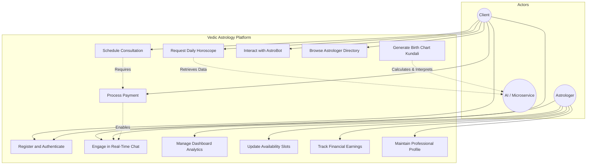
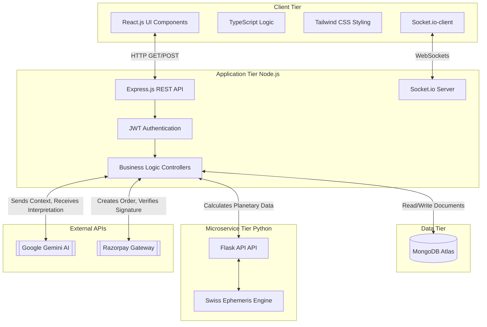
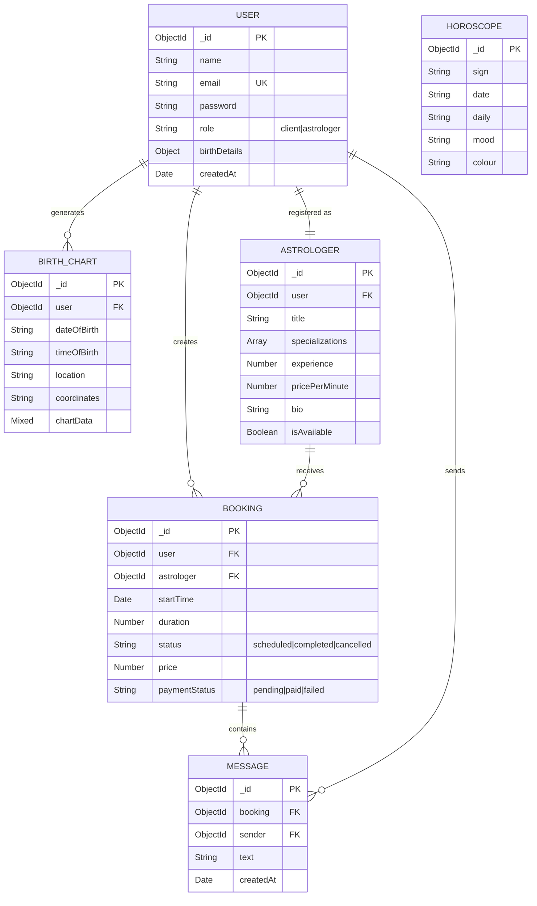
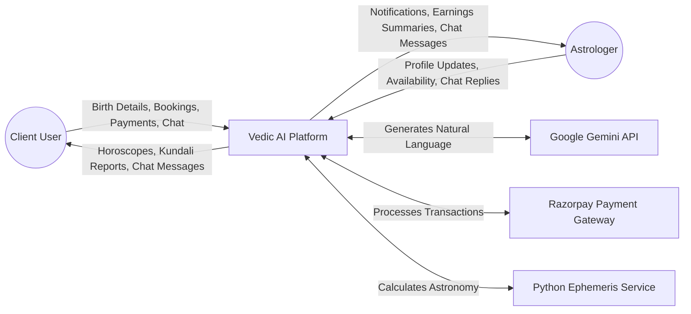
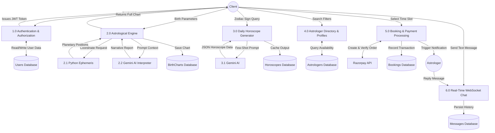
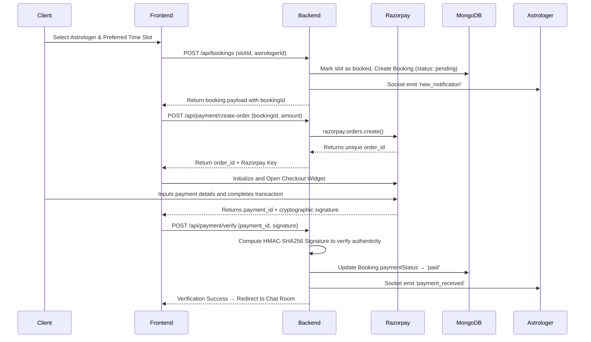
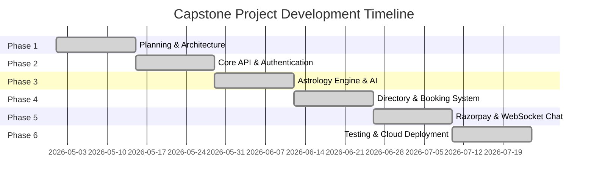

# Capstone Project Report

**Project Title:** Vedic AI Astrology & Real-Time Consultation Platform  
**Document Type:** Final Capstone Project Report  

---

# DECLARATION

We hereby declare that the project work entitled **"Vedic AI Astrology & Real-Time Consultation Platform"** is an authentic record of our own work carried out as requirements of Capstone Project for the award of B.Tech degree in Computer Science and Engineering from Lovely Professional University, Phagwara, under the guidance of Dr. Varun Dogra, during January to May 2026. All the information furnished in this capstone project report is based on our own intensive work and is genuine.

**Submitted By:**  
[Student Name / Registration Number]  
[Student Name / Registration Number]  
*(Please replace the brackets with your actual names and registration numbers)*

**Date:** _______________

---

# 1. Introduction

## 1.1 Objective of the Project

The primary objective of this project is to conceptualize, design, and develop a comprehensive web-based platform that harmonizes the ancient wisdom of Vedic astrology with modern artificial intelligence and real-time communication technologies. The system is designed to democratize access to personalized astrological guidance by delivering:

1. **AI-Powered Astrological Insights:** Utilizing a dedicated Python Microservice equipped with the Swiss Ephemeris to calculate highly precise planetary positions based on user birth details, and feeding this data into Google's Gemini Large Language Model (LLM) to generate personalized, insightful, and human-readable horoscopes and Kundali interpretations.
2. **Expert Consultation Marketplace:** Creating a seamless, real-time marketplace where users can browse verified astrologer profiles, book consultation time slots, securely process payments via the Razorpay gateway, and engage in real-time chat sessions powered by WebSockets (Socket.io).
3. **Comprehensive Astrologer Dashboard:** Providing astrologers with robust business management tools, including earnings analytics, dynamic availability scheduling, booking lifecycle management, and real-time notification systems.

## 1.2 Description of the Project

The Vedic AI Astrology Platform is a modern, responsive, full-stack single-page application (SPA) built upon a microservices-influenced architecture. It caters to two primary user roles: **Clients** seeking guidance and **Astrologers** providing services.

The system incorporates several core modules working in tandem to provide a seamless user experience:

- **Authentication & Security:** Secure JSON Web Token (JWT) based registration and login system with role-based access control (RBAC). Passwords are cryptographically hashed using bcrypt.
- **AI Horoscope Engine:** An intelligent pipeline that generates daily horoscopes tailored to individual zodiac signs using few-shot prompting techniques with the Gemini AI, reducing manual content creation while maintaining high relevance.
- **Precision Kundali Generation:** A backend module that geocodes user birth locations and interacts with a Python Flask microservice (pyswisseph) to calculate precise planetary longitudes and house cusps. This astronomical data is translated into comprehensive life readings by the AI.
- **Real-Time Communication Module:** A secure, bidirectional chat interface built on Socket.io, allowing clients and astrologers to communicate instantly once a consultation is booked and paid for.
- **Integrated Payment Processing:** A robust checkout flow utilizing Razorpay to handle consultation fees safely, featuring server-side signature verification to ensure transaction integrity.
- **Astrologer Management Suite:** A dedicated portal for service providers to manage their public profiles, adjust working hours, track completed sessions, and monitor financial earnings.

## 1.3 Scope of the Project

The scope encompasses the complete software development lifecycle of the web application, focusing on core functionality essential for an astrology marketplace.

**In-Scope Functionalities:**
- User registration, authentication, and distinct role management.
- Integration of the Swiss Ephemeris for accurate celestial calculations.
- AI-generated personalized reports based on precise birth time and coordinates.
- A functional booking calendar with real-time slot management.
- Secure payment gateway integration for processing consultation fees.
- Real-time text-based chat application for active consultations.
- Dashboard analytics for astrologers to track bookings and earnings.

**Out-of-Scope Functionalities:**
- Video and Audio calling capabilities (WebRTC).
- Native mobile applications for iOS and Android platforms.
- Multi-lingual AI generation beyond the primary supported languages.
- Advanced administrative dashboards for platform-wide content moderation.

### 1.3.1 Use Case Diagram

The following Use Case Diagram illustrates the primary interactions between the actors (Client, Astrologer, and the AI System) and the platform's features.

---

# 2. System Description

## 2.1 Customer / User Profiles

Understanding the target audience is crucial for designing an intuitive user interface and aligning system features with user needs.

**Profile 1: The Client (Service Seeker)**
- **Demographics:** Individuals spanning various age groups (typically 18–65) who hold an interest in spirituality, self-discovery, and traditional astrological guidance.
- **Technical Proficiency:** Ranging from novice to intermediate. They require a frictionless, aesthetically pleasing, and highly intuitive navigation experience.
- **Primary Goals:** To obtain accurate astrological readings, explore their birth charts, and seek personalized, confidential advice from human experts regarding significant life events such as career choices, relationships, and health.

**Profile 2: The Astrologer (Service Provider)**
- **Demographics:** Certified and experienced practitioners of Vedic astrology.
- **Technical Proficiency:** Generally novice. They require a straightforward, professional dashboard that clearly displays upcoming appointments, active chat windows, and financial metrics without overwhelming technical complexity.
- **Primary Goals:** To monetize their expertise, expand their digital footprint, efficiently manage their consultation schedule, and communicate reliably with clients.

## 2.2 Assumptions and Dependencies

**Assumptions:**
- Users possess reliable internet connectivity and modern web browsers.
- Clients have access to valid digital payment methods (Credit/Debit cards, UPI, NetBanking) supported by the integrated gateway.
- Users provide accurate birth details, as the precision of the generated Kundali is heavily reliant on the exactness of the input data.

**System Dependencies:**

| Dependency | Purpose in System | Impact of Unavailability |
|------------|-------------------|--------------------------|
| **Google Gemini API** | Natural language generation for horoscopes and Kundali interpretations. | System falls back to generalized, deterministic text responses. |
| **Razorpay API** | Secure processing of financial transactions. | Clients cannot complete bookings; consultations cannot commence. |
| **Swiss Ephemeris (pyswisseph)** | High-precision planetary position calculations via Python microservice. | The core Kundali generation feature fails to produce charts. |
| **MongoDB Atlas** | Primary cloud database for storing all user, booking, and chat data. | The entire application becomes non-functional. |
| **Nominatim Geocoding** | Translating city names into latitude/longitude coordinates. | System defaults to a standard coordinate (e.g., New Delhi), slightly reducing chart accuracy for other locations. |

## 2.3 Functional Requirements

Functional requirements define the specific behaviors and capabilities the system must possess to satisfy user needs.

| Req ID | Module | Description | Priority |
|--------|--------|-------------|----------|
| FR-01 | Authentication | The system shall permit users to register accounts assigned to either a 'Client' or 'Astrologer' role. | High |
| FR-02 | Authentication | The system shall authenticate users using JWT and cryptographically secure passwords using bcrypt. | High |
| FR-03 | AI Horoscope | The system shall utilize few-shot prompting with the Gemini API to generate daily horoscopes based on zodiac signs. | High |
| FR-04 | Kundali Engine | The system shall accept birth parameters (date, time, location) and perform geocoding to retrieve coordinates. | High |
| FR-05 | Kundali Engine | The system shall dispatch coordinates to a Python microservice to compute accurate Navagraha planetary positions. | High |
| FR-06 | Kundali Engine | The system shall supply the planetary data to the Gemini AI to synthesize a personalized, human-readable Kundali interpretation. | High |
| FR-07 | Directory | The system shall display a comprehensive, filterable list of active astrologers, detailing their specializations, pricing, and user ratings. | High |
| FR-08 | Booking | Clients shall be empowered to select available time slots and initiate booking requests for specific astrologers. | High |
| FR-09 | Payments | The system shall generate Razorpay orders and securely verify payment signatures on the backend before finalizing a booking. | High |
| FR-10 | Live Chat | Upon successful payment verification, the system shall instantiate a dedicated WebSocket room for real-time consultation messaging. | High |
| FR-11 | Live Chat | The system shall persistently store all consultation chat transcripts in the database for future reference. | Medium |
| FR-12 | Dashboard | The system shall provide astrologers with a dashboard aggregating total bookings, daily sessions, and cumulative earnings. | High |
| FR-13 | Dashboard | The system shall allow astrologers to dynamically manage their availability calendar and edit their public profiles. | Medium |
| FR-14 | Notifications | The system shall push real-time WebSocket notifications to astrologers upon the receipt of new bookings and successful payments. | High |

## 2.4 Non-Functional Requirements

Non-functional requirements specify the quality attributes, performance goals, and security constraints of the system.

| Req ID | Category | Description |
|--------|----------|-------------|
| NFR-01 | Performance | The generation of AI horoscopes and birth charts, including all external API round-trips, shall complete within 5 to 7 seconds. |
| NFR-02 | Performance | The WebSocket chat infrastructure must ensure message delivery latency does not exceed 200 milliseconds under normal load. |
| NFR-03 | Security | All protected Application Programming Interface (API) endpoints must strictly validate the presence and integrity of a JWT Bearer token. |
| NFR-04 | Security | User passwords must never be stored in plaintext; they shall be hashed using the bcrypt algorithm with a minimum work factor of 10. |
| NFR-05 | Security | The system shall maintain Payment Card Industry (PCI) compliance by completely offloading the collection and processing of credit card data to Razorpay. |
| NFR-06 | Reliability | The system architecture must incorporate graceful fallback mechanisms to provide deterministic responses if the primary AI API experiences downtime or rate-limiting. |
| NFR-07 | Usability | The user interface must employ responsive design principles to ensure seamless operation across desktop, tablet, and mobile devices. |
| NFR-08 | Scalability | The backend shall utilize a stateless authentication model (JWT) to facilitate effortless horizontal scaling of Node.js instances as user traffic grows. |

---

# 3. Technology Stack and Architecture

The platform is engineered using a robust, modern technology stack designed for high performance, rapid development, and scalability. The architecture is primarily divided into a Frontend client, a Backend server, and a specialized Microservice.

## 3.1 Frontend Technology Stack

The client-side application is responsible for rendering the user interface and managing state.

- **React.js (v18):** A declarative, component-based JavaScript library used for building dynamic user interfaces. It ensures efficient DOM updates and a smooth single-page application experience.
- **TypeScript:** Adds static typing to JavaScript, enhancing code quality, readability, and significantly reducing runtime errors during development.
- **Vite:** A next-generation frontend tooling solution that provides extremely fast hot module replacement (HMR) and optimized build processes.
- **Tailwind CSS & ShadCN UI:** A utility-first CSS framework combined with beautifully designed, accessible UI components. This combination allows for rapid, consistent styling without writing custom CSS files.
- **Socket.io-client:** Enables real-time, bidirectional, event-based communication with the server for the live chat and notification features.

## 3.2 Backend Technology Stack

The server-side application handles business logic, database interactions, and API integrations.

- **Node.js & Express.js:** Node.js provides a fast, asynchronous, event-driven JavaScript runtime environment. Express.js acts as a minimal and flexible web application framework, simplifying route management and middleware integration.
- **MongoDB & Mongoose:** MongoDB serves as the primary NoSQL database, offering high flexibility for storing complex, hierarchical astrological data. Mongoose provides a rigorous schema-based solution to model application data.
- **Socket.io:** The server counterpart for managing WebSocket connections, handling chat rooms, and broadcasting real-time events to connected clients.
- **Google Gemini API:** Integrates advanced Large Language Models (gemini-2.5-flash) to perform natural language processing and generate dynamic astrological content.

## 3.3 Microservice Technology Stack

A dedicated microservice handles computationally expensive astronomical calculations to prevent blocking the main Node.js event loop.

- **Python & Flask:** A lightweight web application framework in Python used to expose astronomical calculation functions as RESTful API endpoints.
- **Swiss Ephemeris (pyswisseph):** A highly accurate planetary calculation library widely regarded as the industry standard among professional astrologers. It computes exact planetary longitudes and house systems required for authentic Vedic astrology.

## 3.4 Technology Stack Working Diagram

The following diagram illustrates how these technologies interact to fulfill a user request, specifically highlighting the separation of concerns between the frontend, the main backend API, and the specialized microservice.

**Explanation of the Workflow:**
When a user requests a Birth Chart, the **React frontend** sends the birth details via an HTTP request to the **Express.js backend**. The backend immediately delegates the heavy mathematical calculations to the **Python Flask Microservice**, which utilizes the **Swiss Ephemeris**. Once the precise planetary coordinates are returned, the Express backend formats this data into a structured prompt and sends it to the **Google Gemini API**. Gemini processes the prompt and returns a comprehensive, human-readable astrological interpretation. Finally, the Express backend saves the complete package to **MongoDB** and returns it to the React frontend for display.

---

# 4. System Design

## 4.1 Entity-Relationship (E-R) Diagram

The Entity-Relationship diagram outlines the logical structure of the database, illustrating the primary entities and the relationships connecting them.

## 4.2 Data Flow Diagrams (DFDs)

Data Flow Diagrams provide a graphical representation of the flow of data through the information system, modeling its process aspects.

### Level 0 — Context Diagram
This high-level diagram represents the entire system as a single process interacting with external entities.

### Level 1 — Process Decomposition
This diagram breaks down the main system into major functional sub-processes.

### Level 2 — Booking and Payment Sequence
A detailed sequence diagram illustrating the precise flow of operations during a consultation booking and payment event.

---

# 5. Database Design

The system utilizes MongoDB, a NoSQL database, allowing for flexible, document-oriented storage which is highly suitable for hierarchical data structures like astrological charts. Below are the data dictionary definitions for the core collections.

### Table 1: Users Collection

| Field Name | Data Type | Description | Constraints |
|------------|-----------|-------------|-------------|
| `_id` | ObjectId | Primary Key Identifier | Auto-generated by MongoDB |
| `name` | String | The user's full legal name | Required |
| `email` | String | Email address used for authentication | Required, Must be Unique |
| `password` | String | The bcrypt-hashed representation of the password | Required |
| `role` | String | Defines system privileges | Enum: `client`, `astrologer` |
| `birthDetails.date` | Date | The user's date of birth | Optional |
| `birthDetails.time` | String | The user's time of birth | Optional |
| `birthDetails.place` | String | The user's city of birth | Optional |
| `createdAt` | Date | Timestamp of account creation | Auto-generated (Mongoose) |

### Table 2: Astrologers Collection

| Field Name | Data Type | Description | Constraints |
|------------|-----------|-------------|-------------|
| `_id` | ObjectId | Primary Key Identifier | Auto-generated by MongoDB |
| `user` | ObjectId | Foreign Key linking to the Users collection | Required, Ref: 'User' |
| `title` | String | Professional title (e.g., Vedic Expert) | Required |
| `specializations` | [String] | Array of specific astrological skills | Required |
| `experience` | Number | Years of active practice | Required |
| `rating` | Number | Aggregate user review score | Default: 5.0 |
| `pricePerMinute` | Number | The rate charged for consultations (in ₹) | Required |
| `bio` | String | Detailed professional biography | Required |
| `isAvailable` | Boolean | Toggles visibility for immediate consultations | Default: true |

### Table 3: Bookings Collection

| Field Name | Data Type | Description | Constraints |
|------------|-----------|-------------|-------------|
| `_id` | ObjectId | Primary Key Identifier | Auto-generated by MongoDB |
| `user` | ObjectId | Foreign Key linking to the Client | Required, Ref: 'User' |
| `astrologer` | ObjectId | Foreign Key linking to the Astrologer | Required, Ref: 'Astrologer' |
| `startTime` | Date | The scheduled start time of the consultation | Required |
| `duration` | Number | The length of the session in minutes | Required |
| `status` | String | Current lifecycle stage of the booking | Enum: `scheduled`, `completed`, `cancelled` |
| `price` | Number | Total cost calculated for the session | Required |
| `paymentStatus` | String | The state of financial settlement | Enum: `pending`, `paid`, `failed` |

### Table 4: Messages Collection

| Field Name | Data Type | Description | Constraints |
|------------|-----------|-------------|-------------|
| `_id` | ObjectId | Primary Key Identifier | Auto-generated by MongoDB |
| `booking` | ObjectId | Foreign Key linking to the associated Booking | Required, Ref: 'Booking' |
| `sender` | ObjectId | Foreign Key indicating who sent the message | Required, Ref: 'User' |
| `text` | String | The plaintext content of the message | Required |
| `createdAt` | Date | Timestamp of when the message was dispatched | Auto-generated (Mongoose) |

---

# 6. Implementation Details

## 6.1 Application Programming Interface (API)

The backend exposes a RESTful API to handle all client-server communications securely.

| HTTP Method | API Endpoint Route | Authentication | Description |
|-------------|--------------------|----------------|-------------|
| POST | `/api/auth/register` | None | Registers a new user account. |
| POST | `/api/auth/login` | None | Authenticates user and issues a JWT. |
| GET | `/api/users/profile` | Required | Retrieves the authenticated user's profile. |
| PUT | `/api/users/profile` | Required | Updates user details and saved birth data. |
| GET | `/api/astro/horoscope/:sign` | None | Fetches or generates the daily AI horoscope for a sign. |
| POST | `/api/astro/birth-chart` | None | Initiates the complex Kundali generation workflow. |
| GET | `/api/astrologers` | None | Retrieves the public directory of all active astrologers. |
| GET | `/api/astrologers/dashboard`| Astrologer | Fetches aggregate analytics for the astrologer dashboard. |
| PUT | `/api/astrologers/availability`| Astrologer | Toggles online presence and defines working slots. |
| POST | `/api/bookings` | Client | Creates a new consultation booking request. |
| PATCH | `/api/bookings/:id/pay` | Client | Modifies booking state upon successful payment. |
| POST | `/api/payment/create-order` | Client | Interacts with Razorpay to initiate a transaction. |
| POST | `/api/payment/verify` | Client | Validates the cryptographic signature returned by Razorpay. |
| GET | `/api/chat/:bookingId` | Participant | Retrieves historical chat transcripts for a specific session. |

## 6.2 WebSocket Event Architecture

Real-time capabilities are facilitated by an event-driven WebSocket architecture utilizing Socket.io.

| Event Name | Direction | Payload Structure | Functionality |
|------------|-----------|-------------------|---------------|
| `join_room` | Client → Server | `roomId` (String) | Subscribes a user to a specific consultation communication channel. |
| `send_message` | Client → Server | `{roomId, sender, text}` | Transmits a new message payload to the server for distribution. |
| `receive_message` | Server → Client | `{_id, sender, text, createdAt}` | Broadcasts the persisted message to all connected peers in the room. |
| `new_notification`| Server → Client | `{type, message, bookingId}` | Pushes immediate alerts regarding new bookings or payment confirmations to the astrologer UI. |

---

# 7. Scheduling and Project Management

The development lifecycle is managed using Agile methodologies, broken down into sequential, two-week sprints.

| Phase | Sprint Focus | Key Deliverables | Duration | Est. Hours |
|-------|--------------|------------------|----------|------------|
| Phase 1 | Planning & Setup | Requirements gathering, Architectural design, Database Schema formulation, CI/CD pipeline setup. | Weeks 1–2 | 80 hrs |
| Phase 2 | Core Infrastructure | User Authentication (JWT), Express.js REST API boilerplate, React Router implementation. | Weeks 3–4 | 90 hrs |
| Phase 3 | AI & Astrology Engine | Python microservice integration, Gemini AI prompt engineering, Kundali chart rendering UI. | Weeks 5–6 | 110 hrs |
| Phase 4 | The Marketplace | Astrologer public profiles, search and filtering logic, Booking calendar component. | Weeks 7–8 | 100 hrs |
| Phase 5 | Payments & Comm. | Razorpay API integration, Socket.io real-time chat architecture, message persistence. | Weeks 9–10 | 120 hrs |
| Phase 6 | Finalization & Deployment| Dashboard analytics, comprehensive bug fixing, User Acceptance Testing (UAT), Cloud deployment. | Weeks 11–12| 80 hrs |
| **Total** | | | **12 Weeks** | **580 Hrs** |

### 7.1 Gantt Chart Representation

---

# 8. Software Testing

The software testing phase ensures that all core functionalities of the Vedic AI Astrology Platform operate reliably under expected conditions. Test cases focus on verifying the integration between the user interface, backend APIs, and external microservices.

## 8.1 Functional Testing

Functional testing ensures that the system behaves as specified in the functional requirements.

### 8.1.1 Authentication & Role Management

| Test Case ID | Feature | Description | Expected Result | Status |
|---|---|---|---|---|
| TC-F-01 | User Registration | Submit registration form with valid email and strong password. | Account is created, password is hashed via bcrypt, and user is redirected to login. | Pass |
| TC-F-02 | Role Assignment | Register as 'Astrologer' and verify database role constraint. | The `role` field in MongoDB is explicitly set to 'astrologer'. | Pass |
| TC-F-03 | JWT Authorization | Access protected `/api/users/profile` without a Bearer token. | System returns `401 Unauthorized`. | Pass |

### 8.1.2 Astrology Engine & AI Integration

| Test Case ID | Feature | Description | Expected Result | Status |
|---|---|---|---|---|
| TC-F-04 | Ephemeris Calculation | Submit valid birth date, time, and coordinates to the Python microservice. | Microservice returns accurate Navagraha planetary degrees. | Pass |
| TC-F-05 | Gemini Prompting | Request daily horoscope generation for a specific Zodiac sign. | Gemini returns structured JSON matching the few-shot template. | Pass |
| TC-F-06 | Geocoding Fallback | Submit an invalid or unrecognized city name for birth chart. | System catches error and defaults to standard coordinates. | Pass |

### 8.1.3 Booking, Payments & Chat

| Test Case ID | Feature | Description | Expected Result | Status |
|---|---|---|---|---|
| TC-F-07 | Order Creation | Client proceeds to checkout for a standard consultation. | Backend generates a unique Razorpay `order_id` matching the consultation price. | Pass |
| TC-F-08 | Signature Verification | Submit mocked valid Razorpay payment signature to verification endpoint. | Backend computes HMAC SHA-256, verifies match, and updates status to 'paid'. | Pass |
| TC-F-09 | Room Isolation | Two different clients join separate chat rooms (`bookingId`). | Messages sent in Room A are not broadcasted to Room B. | Pass |

## 8.2 Non-Functional Testing

Non-functional testing evaluates the system's readiness in terms of performance, security, usability, and reliability.

### 8.2.1 Performance & Reliability

| Test Case ID | Category | Description | Expected Result | Status |
|---|---|---|---|---|
| TC-NF-01 | Performance | Measure round-trip time for AI Horoscope generation. | Response is received and rendered within 5-7 seconds. | Pass |
| TC-NF-02 | Performance | Measure WebSocket message delivery latency between clients. | Message appears on recipient's screen in under 200ms. | Pass |
| TC-NF-03 | Reliability | Simulate a timeout/failure from the Google Gemini API. | System gracefully catches the error and returns a predefined deterministic fallback horoscope. | Pass |

### 8.2.2 Security & Usability

| Test Case ID | Category | Description | Expected Result | Status |
|---|---|---|---|---|
| TC-NF-04 | Security | Attempt SQL/NoSQL injection in the login endpoint payload. | Mongoose sanitizes inputs; login fails without compromising database. | Pass |
| TC-NF-05 | Security | Intercept network traffic during payment checkout. | Credit card details are exclusively handled by Razorpay's iframe; no sensitive data touches the backend. | Pass |
| TC-NF-06 | Usability | Render the Astrologer Dashboard on a 375px mobile viewport. | All charts, tables, and navigation elements scale appropriately without horizontal scrolling. | Pass |
## 8.3 Testing Methodologies & Automation

To ensure continuous stability across development iterations, a multi-layered testing methodology was adopted:

### 8.3.1 Smoke Testing
Before any major deployment to the staging environment, a rapid suite of Smoke Tests is executed. This ensures that critical infrastructure—such as database connectivity, external API reachability (Google Gemini, Razorpay), and the Python Microservice health—is fully operational. If the smoke tests fail, the build is immediately halted.

### 8.3.2 Regression Testing
As new features (such as real-time chat and payment gateways) were integrated, comprehensive Regression Testing was performed. This guaranteed that newly introduced code did not negatively impact the existing, stable core modules (such as Authentication and Kundali generation).

### 8.3.3 Automated UI Testing via Selenium WebDriver
To simulate real-world user interactions across the application's critical paths, **Selenium WebDriver** was utilized for Automated UI Testing. 

| Automated Test Scenario | Selenium Action Sequence | Validation Point |
|---|---|---|
| E2E Booking Flow | Navigate to directory -> Click Astrologer -> Select Time -> Submit | Verifies successful redirection to the Razorpay checkout widget. |
| AI Chatbot Responsiveness | Login -> Open Chat -> Input Birth Details -> Send | Validates that the UI successfully renders the streamed Gemini AI text chunks dynamically. |
| Dashboard State | Login as Astrologer -> Toggle Availability -> Refresh Page | Asserts that the 'Online' status indicator persists across sessions. |

---

# 9. Conclusion

The Vedic AI Astrology & Real-Time Consultation Platform represents a significant technical achievement, successfully converging deeply traditional astrological practices with cutting-edge software engineering. By engineering a robust microservices architecture, the project efficiently handles computationally heavy astronomical algorithms via Python, while leveraging the speed and scalability of Node.js for real-time web communication.

The integration of Google's Gemini Large Language Model transforms raw celestial coordinates into highly personalized, human-readable insights, proving the immense potential of generative AI in niche, domain-specific applications. Furthermore, the seamless incorporation of Razorpay for secure financial transactions and Socket.io for instantaneous bidirectional communication creates a comprehensive, end-to-end marketplace that empowers both seekers of astrological wisdom and the experts providing it. 

Ultimately, this capstone project demonstrates proficiency in full-stack development, complex API integration, real-time networking, and system architecture, resulting in a production-ready application poised to deliver value in the digital astrology domain.

---
*End of Capstone Project Report*
