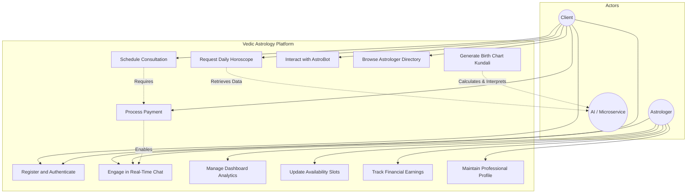
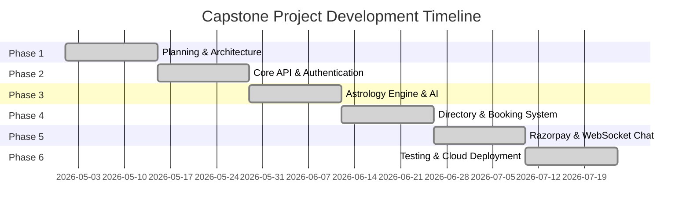
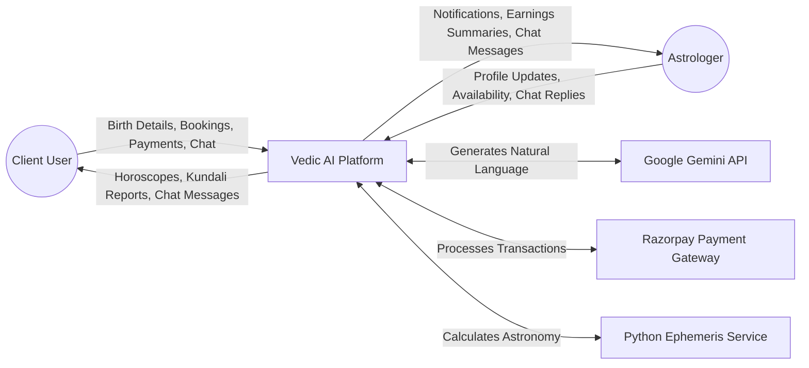
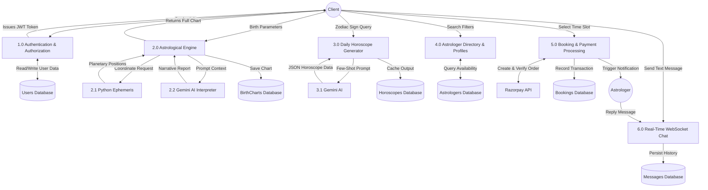
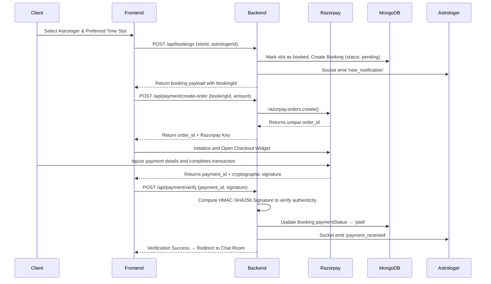
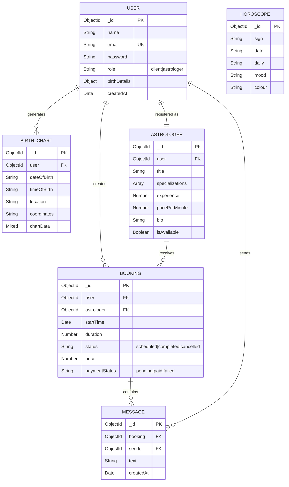

# Capstone Project Report

**Project Title:** Vedic AI Astrology & Real-Time Consultation Platform  
**Document Type:** Final Capstone Project Report  

---

# DECLARATION

We hereby declare that the project work entitled **"Vedic AI Astrology & Real-Time Consultation Platform"** is an authentic record of our own work carried out as requirements of Capstone Project for the award of B.Tech degree in Computer Science and Engineering from Lovely Professional University, Phagwara, under the guidance of Dr. Varun Dogra, during January to May 2026. All the information furnished in this capstone project report is based on our own intensive work and is genuine.

**Submitted By:**  
[Student Name / Registration Number]  
[Student Name / Registration Number]  
*(Please replace the brackets with your actual names and registration numbers)*

**Date:** _______________

---

# 1. Introduction

## 1.1 Objective of the Project

The primary objective of this project is to conceptualize, design, and develop a comprehensive web-based platform that harmonizes the ancient wisdom of Vedic astrology with modern artificial intelligence and real-time communication technologies. The system is designed to democratize access to personalized astrological guidance by delivering:

1. **AI-Powered Astrological Insights:** Utilizing a dedicated Python Microservice equipped with the Swiss Ephemeris to calculate highly precise planetary positions based on user birth details, and feeding this data into Google's Gemini Large Language Model (LLM) to generate personalized, insightful, and human-readable horoscopes and Kundali interpretations.
2. **Expert Consultation Marketplace:** Creating a seamless, real-time marketplace where users can browse verified astrologer profiles, book consultation time slots, securely process payments via the Razorpay gateway, and engage in real-time chat sessions powered by WebSockets (Socket.io).
3. **Comprehensive Astrologer Dashboard:** Providing astrologers with robust business management tools, including earnings analytics, dynamic availability scheduling, booking lifecycle management, and real-time notification systems.

## 1.2 Description of the Project

The Vedic AI Astrology Platform is a modern, responsive, full-stack single-page application (SPA) built upon a microservices-influenced architecture. It caters to two primary user roles: **Clients** seeking guidance and **Astrologers** providing services.

The system incorporates several core modules working in tandem to provide a seamless user experience:

- **Authentication & Security:** Secure JSON Web Token (JWT) based registration and login system with role-based access control (RBAC). Passwords are cryptographically hashed using bcrypt.
- **AI Horoscope Engine:** An intelligent pipeline that generates daily horoscopes tailored to individual zodiac signs using few-shot prompting techniques with the Gemini AI, reducing manual content creation while maintaining high relevance.
- **Precision Kundali Generation:** A backend module that geocodes user birth locations and interacts with a Python Flask microservice (pyswisseph) to calculate precise planetary longitudes and house cusps. This astronomical data is translated into comprehensive life readings by the AI.
- **Real-Time Communication Module:** A secure, bidirectional chat interface built on Socket.io, allowing clients and astrologers to communicate instantly once a consultation is booked and paid for.
- **Integrated Payment Processing:** A robust checkout flow utilizing Razorpay to handle consultation fees safely, featuring server-side signature verification to ensure transaction integrity.
- **Astrologer Management Suite:** A dedicated portal for service providers to manage their public profiles, adjust working hours, track completed sessions, and monitor financial earnings.

## 1.3 Scope of the Project

The scope encompasses the complete software development lifecycle of the web application, focusing on core functionality essential for an astrology marketplace.

**In-Scope Functionalities:**
- User registration, authentication, and distinct role management.
- Integration of the Swiss Ephemeris for accurate celestial calculations.
- AI-generated personalized reports based on precise birth time and coordinates.
- A functional booking calendar with real-time slot management.
- Secure payment gateway integration for processing consultation fees.
- Real-time text-based chat application for active consultations.
- Dashboard analytics for astrologers to track bookings and earnings.

**Out-of-Scope Functionalities:**
- Video and Audio calling capabilities (WebRTC).
- Native mobile applications for iOS and Android platforms.
- Multi-lingual AI generation beyond the primary supported languages.
- Advanced administrative dashboards for platform-wide content moderation.

### 1.3.1 Use Case Diagram

The following Use Case Diagram illustrates the primary interactions between the actors (Client, Astrologer, and the AI System) and the platform's features.




---

# 2. PROFILE OF THE PROBLEM – RATIONALE / SCOPE OF THE STUDY

Traditional Vedic astrology relies on complex astronomical calculations (Kundali generation) and interpretation by experienced practitioners. Currently, seekers of astrological guidance must rely on fragmented ecosystems: either fully automated apps that provide generic, non-interactive horoscopes, or manual booking of human astrologers which can be costly and lack immediate availability. 

The rationale for this study is to bridge the gap between high-precision traditional astrological mathematics and modern Generative AI. By leveraging the Swiss Ephemeris and Google's Gemini LLM, we can democratize access to instant, highly personalized interpretations, while simultaneously providing a real-time marketplace (via WebSockets and Razorpay) for users who require deeper, human expert consultation. The scope encompasses the development of a full-stack platform acting as both an automated AI oracle and a peer-to-peer consultation booking system.

---

# 3. EXISTING SYSTEM

## 3.1 Introduction
The existing ecosystem of astrological services is largely divided into two extreme categories: entirely manual offline consultations or generic automated websites.

## 3.2 Existing Software
Existing platforms like generalized horoscope sites provide daily readings based on Sun signs but lack the mathematical rigor of generating exact Navagraha positions based on precise geographical coordinates. Alternatively, platforms linking users to astrologers often suffer from high latency in communication, lack of an integrated chat interface, or poor user experience. 

## 3.3 DFD for Present System
In the existing manual system, a user manually searches for an astrologer, emails birth details, waits days for a chart calculation, and coordinates payment offline. 

## 3.4 What Is New in the System to Be Developed
Our system introduces:
1. **Real-Time AI Microservice:** Instantly computes precise Kundali charts using Python and translates them via Gemini AI.
2. **Integrated Real-Time Chat:** A Socket.io architecture allowing users to instantly text astrologers post-payment.
3. **Automated Verification:** Secure payment gateway integration directly modifying booking states without manual intervention.

---

# 4. PROBLEM ANALYSIS

## 4.1 Product Definition
The product is a Single Page Application (SPA) utilizing the MERN stack and a Python microservice, designed to provide AI-driven astrological insights and facilitate secure, real-time communication between clients and verified astrologers.

## 4.2 Feasibility Analysis

### 4.2.1 Technical Feasibility
The project is highly technically feasible. Node.js efficiently handles WebSocket connections, React provides a responsive UI, and Python handles the mathematical load using the well-documented `pyswisseph` library.

### 4.2.2 Economic Feasibility
The system is economically viable as it relies on open-source frameworks (React, Express, Flask) and freemium cloud tiers (MongoDB Atlas, Google Gemini API free tier, Razorpay test mode) during development. 

### 4.2.3 Operational Feasibility
The intuitive dashboard design ensures that astrologers (who may have low technical proficiency) can easily manage their availability and bookings, proving the system operationally sound.

## 4.3 Project Plan

The development lifecycle is managed using Agile methodologies, broken down into sequential, two-week sprints.

| Phase | Sprint Focus | Key Deliverables | Duration | Est. Hours |
|-------|--------------|------------------|----------|------------|
| Phase 1 | Planning & Setup | Requirements gathering, Architectural design, Database Schema formulation, CI/CD pipeline setup. | Weeks 1–2 | 80 hrs |
| Phase 2 | Core Infrastructure | User Authentication (JWT), Express.js REST API boilerplate, React Router implementation. | Weeks 3–4 | 90 hrs |
| Phase 3 | AI & Astrology Engine | Python microservice integration, Gemini AI prompt engineering, Kundali chart rendering UI. | Weeks 5–6 | 110 hrs |
| Phase 4 | The Marketplace | Astrologer public profiles, search and filtering logic, Booking calendar component. | Weeks 7–8 | 100 hrs |
| Phase 5 | Payments & Comm. | Razorpay API integration, Socket.io real-time chat architecture, message persistence. | Weeks 9–10 | 120 hrs |
| Phase 6 | Finalization & Deployment| Dashboard analytics, comprehensive bug fixing, User Acceptance Testing (UAT), Cloud deployment. | Weeks 11–12| 80 hrs |
| **Total** | | | **12 Weeks** | **580 Hrs** |

### 7.1 Gantt Chart Representation




---

# 5. SOFTWARE REQUIREMENT ANALYSIS

## 5.1 Introduction
This section details the functional and non-functional specifications that the system must adhere to.

## 5.2 General Description
The system operates securely using JWT authentication, segregating user roles into Clients and Astrologers to protect sensitive consultation data.

## 5.3 Specific Requirements

## 5.3.1 Functional Requirements

Functional requirements define the specific behaviors and capabilities the system must possess to satisfy user needs.

| Req ID | Module | Description | Priority |
|--------|--------|-------------|----------|
| FR-01 | Authentication | The system shall permit users to register accounts assigned to either a 'Client' or 'Astrologer' role. | High |
| FR-02 | Authentication | The system shall authenticate users using JWT and cryptographically secure passwords using bcrypt. | High |
| FR-03 | AI Horoscope | The system shall utilize few-shot prompting with the Gemini API to generate daily horoscopes based on zodiac signs. | High |
| FR-04 | Kundali Engine | The system shall accept birth parameters (date, time, location) and perform geocoding to retrieve coordinates. | High |
| FR-05 | Kundali Engine | The system shall dispatch coordinates to a Python microservice to compute accurate Navagraha planetary positions. | High |
| FR-06 | Kundali Engine | The system shall supply the planetary data to the Gemini AI to synthesize a personalized, human-readable Kundali interpretation. | High |
| FR-07 | Directory | The system shall display a comprehensive, filterable list of active astrologers, detailing their specializations, pricing, and user ratings. | High |
| FR-08 | Booking | Clients shall be empowered to select available time slots and initiate booking requests for specific astrologers. | High |
| FR-09 | Payments | The system shall generate Razorpay orders and securely verify payment signatures on the backend before finalizing a booking. | High |
| FR-10 | Live Chat | Upon successful payment verification, the system shall instantiate a dedicated WebSocket room for real-time consultation messaging. | High |
| FR-11 | Live Chat | The system shall persistently store all consultation chat transcripts in the database for future reference. | Medium |
| FR-12 | Dashboard | The system shall provide astrologers with a dashboard aggregating total bookings, daily sessions, and cumulative earnings. | High |
| FR-13 | Dashboard | The system shall allow astrologers to dynamically manage their availability calendar and edit their public profiles. | Medium |
| FR-14 | Notifications | The system shall push real-time WebSocket notifications to astrologers upon the receipt of new bookings and successful payments. | High |

## 5.3.2 Non-Functional Requirements

Non-functional requirements specify the quality attributes, performance goals, and security constraints of the system.

| Req ID | Category | Description |
|--------|----------|-------------|
| NFR-01 | Performance | The generation of AI horoscopes and birth charts, including all external API round-trips, shall complete within 5 to 7 seconds. |
| NFR-02 | Performance | The WebSocket chat infrastructure must ensure message delivery latency does not exceed 200 milliseconds under normal load. |
| NFR-03 | Security | All protected Application Programming Interface (API) endpoints must strictly validate the presence and integrity of a JWT Bearer token. |
| NFR-04 | Security | User passwords must never be stored in plaintext; they shall be hashed using the bcrypt algorithm with a minimum work factor of 10. |
| NFR-05 | Security | The system shall maintain Payment Card Industry (PCI) compliance by completely offloading the collection and processing of credit card data to Razorpay. |
| NFR-06 | Reliability | The system architecture must incorporate graceful fallback mechanisms to provide deterministic responses if the primary AI API experiences downtime or rate-limiting. |
| NFR-07 | Usability | The user interface must employ responsive design principles to ensure seamless operation across desktop, tablet, and mobile devices. |
| NFR-08 | Scalability | The backend shall utilize a stateless authentication model (JWT) to facilitate effortless horizontal scaling of Node.js instances as user traffic grows. |


---

# 6. DESIGN

## 6.1 System Design

Data Flow Diagrams provide a graphical representation:

Data Flow Diagrams provide a graphical representation of the flow of data through the information system, modeling its process aspects.

### Level 0 — Context Diagram
This high-level diagram represents the entire system as a single process interacting with external entities.



### Level 1 — Process Decomposition
This diagram breaks down the main system into major functional sub-processes.



### Level 2 — Booking and Payment Sequence
A detailed sequence diagram illustrating the precise flow of operations during a consultation booking and payment event.




## 6.2 Design Notations

The following notations and diagrams, including the Entity-Relationship Diagram, illustrate the logical structure:

The Entity-Relationship diagram outlines the logical structure of the database, illustrating the primary entities and the relationships connecting them.




## 6.3 Detailed Design

### 6.3.1 Frontend Component Architecture
The React frontend is constructed using atomic design principles, grouping components into Pages (Dashboard, Booking), Layouts (Navbars), and UI Elements (Buttons, Modals).

### 6.3.2 Backend Module Structure
The Express.js backend follows the Model-View-Controller (MVC) pattern, separating routing logic, business controllers, and Mongoose database schemas.

### 6.3.3 Database Structure

The system utilizes MongoDB, a NoSQL database, allowing for flexible, document-oriented storage which is highly suitable for hierarchical data structures like astrological charts. Below are the data dictionary definitions for the core collections.

### Table 1: Users Collection

| Field Name | Data Type | Description | Constraints |
|------------|-----------|-------------|-------------|
| `_id` | ObjectId | Primary Key Identifier | Auto-generated by MongoDB |
| `name` | String | The user's full legal name | Required |
| `email` | String | Email address used for authentication | Required, Must be Unique |
| `password` | String | The bcrypt-hashed representation of the password | Required |
| `role` | String | Defines system privileges | Enum: `client`, `astrologer` |
| `birthDetails.date` | Date | The user's date of birth | Optional |
| `birthDetails.time` | String | The user's time of birth | Optional |
| `birthDetails.place` | String | The user's city of birth | Optional |
| `createdAt` | Date | Timestamp of account creation | Auto-generated (Mongoose) |

### Table 2: Astrologers Collection

| Field Name | Data Type | Description | Constraints |
|------------|-----------|-------------|-------------|
| `_id` | ObjectId | Primary Key Identifier | Auto-generated by MongoDB |
| `user` | ObjectId | Foreign Key linking to the Users collection | Required, Ref: 'User' |
| `title` | String | Professional title (e.g., Vedic Expert) | Required |
| `specializations` | [String] | Array of specific astrological skills | Required |
| `experience` | Number | Years of active practice | Required |
| `rating` | Number | Aggregate user review score | Default: 5.0 |
| `pricePerMinute` | Number | The rate charged for consultations (in ₹) | Required |
| `bio` | String | Detailed professional biography | Required |
| `isAvailable` | Boolean | Toggles visibility for immediate consultations | Default: true |

### Table 3: Bookings Collection

| Field Name | Data Type | Description | Constraints |
|------------|-----------|-------------|-------------|
| `_id` | ObjectId | Primary Key Identifier | Auto-generated by MongoDB |
| `user` | ObjectId | Foreign Key linking to the Client | Required, Ref: 'User' |
| `astrologer` | ObjectId | Foreign Key linking to the Astrologer | Required, Ref: 'Astrologer' |
| `startTime` | Date | The scheduled start time of the consultation | Required |
| `duration` | Number | The length of the session in minutes | Required |
| `status` | String | Current lifecycle stage of the booking | Enum: `scheduled`, `completed`, `cancelled` |
| `price` | Number | Total cost calculated for the session | Required |
| `paymentStatus` | String | The state of financial settlement | Enum: `pending`, `paid`, `failed` |

### Table 4: Messages Collection

| Field Name | Data Type | Description | Constraints |
|------------|-----------|-------------|-------------|
| `_id` | ObjectId | Primary Key Identifier | Auto-generated by MongoDB |
| `booking` | ObjectId | Foreign Key linking to the associated Booking | Required, Ref: 'Booking' |
| `sender` | ObjectId | Foreign Key indicating who sent the message | Required, Ref: 'User' |
| `text` | String | The plaintext content of the message | Required |
| `createdAt` | Date | Timestamp of when the message was dispatched | Auto-generated (Mongoose) |


## 6.4 Flowcharts
*(Flowcharts depicting the user registration, AI query processing, and payment checkout flow are integrated within the system documentation).*

## 6.5 Pseudo Code

### 6.5.1 Kundali Calculation Logic
```text
FUNCTION calculateKundali(dob, time, location):
    coordinates = Geocode(location)
    IF Geocode fails:
        RETURN default_coordinates
    planetary_data = call_python_microservice(dob, time, coordinates)
    RETURN planetary_data
```

### 6.5.2 Gemini AI Prompt Generation
```text
FUNCTION generateHoroscope(zodiac_sign):
    prompt = "Generate a daily Vedic horoscope for " + zodiac_sign
    response = call_gemini_api(prompt, few_shot_examples)
    RETURN response.text
```

### 6.5.3 Payment Verification Fallback
```text
FUNCTION verifySignature(order_id, payment_id, signature):
    expected = HMAC_SHA256(order_id + "|" + payment_id, SECRET)
    IF expected == signature:
        updateBookingStatus("PAID")
        emitSocketEvent("PAYMENT_SUCCESS")
    ELSE:
        THROW "Invalid Signature"
```

---

# 7. TESTING

## 7.1 Functional Testing
Functional testing was prioritized to validate the core user flows, including registration, role assignment, and payment order creation. Ensure that outputs match functional specifications.

## 7.2 Structural Testing
Structural (White Box) testing was conducted on backend API controllers to ensure all logical branches (e.g., successful payment vs. failed signature logic) execute correctly and no dead code remains.

## 7.3 Levels of Testing

### 7.3.1 Unit Testing
Individual modules, such as the password hashing utility and the JWT generator, were tested in isolation.

### 7.3.2 Integration Testing
Ensured the Express.js backend successfully communicates with the Python Flask microservice without data loss.

### 7.3.3 System Testing
End-to-End flows, from user login to final WebSocket chat message delivery, were verified in a staging environment.

### 7.3.4 User Acceptance Testing
Simulated beta users navigated the platform to confirm the UI was intuitive and that AI horoscopes met readability standards.

## 7.4 Testing the Project
Below are the detailed test cases executed during the project lifecycle.

### 7.4.1 Functional Testing Details

Functional testing ensures that the system behaves as specified in the functional requirements.

#### 7.4.1.1 Authentication & Role Management

| Test Case ID | Feature | Description | Expected Result | Status |
|---|---|---|---|---|
| TC-F-01 | User Registration | Submit registration form with valid email and strong password. | Account is created, password is hashed via bcrypt, and user is redirected to login. | Pass |
| TC-F-02 | Role Assignment | Register as 'Astrologer' and verify database role constraint. | The `role` field in MongoDB is explicitly set to 'astrologer'. | Pass |
| TC-F-03 | JWT Authorization | Access protected `/api/users/profile` without a Bearer token. | System returns `401 Unauthorized`. | Pass |

#### 7.4.1.2 Astrology Engine & AI Integration

| Test Case ID | Feature | Description | Expected Result | Status |
|---|---|---|---|---|
| TC-F-04 | Ephemeris Calculation | Submit valid birth date, time, and coordinates to the Python microservice. | Microservice returns accurate Navagraha planetary degrees. | Pass |
| TC-F-05 | Gemini Prompting | Request daily horoscope generation for a specific Zodiac sign. | Gemini returns structured JSON matching the few-shot template. | Pass |
| TC-F-06 | Geocoding Fallback | Submit an invalid or unrecognized city name for birth chart. | System catches error and defaults to standard coordinates. | Pass |

#### 7.4.1.3 Booking, Payments & Chat

| Test Case ID | Feature | Description | Expected Result | Status |
|---|---|---|---|---|
| TC-F-07 | Order Creation | Client proceeds to checkout for a standard consultation. | Backend generates a unique Razorpay `order_id` matching the consultation price. | Pass |
| TC-F-08 | Signature Verification | Submit mocked valid Razorpay payment signature to verification endpoint. | Backend computes HMAC SHA-256, verifies match, and updates status to 'paid'. | Pass |
| TC-F-09 | Room Isolation | Two different clients join separate chat rooms (`bookingId`). | Messages sent in Room A are not broadcasted to Room B. | Pass |

### 7.4.2 Non-Functional Testing

Non-functional testing evaluates the system's readiness in terms of performance, security, usability, and reliability.

#### 7.4.2.1 Performance & Reliability

| Test Case ID | Category | Description | Expected Result | Status |
|---|---|---|---|---|
| TC-NF-01 | Performance | Measure round-trip time for AI Horoscope generation. | Response is received and rendered within 5-7 seconds. | Pass |
| TC-NF-02 | Performance | Measure WebSocket message delivery latency between clients. | Message appears on recipient's screen in under 200ms. | Pass |
| TC-NF-03 | Reliability | Simulate a timeout/failure from the Google Gemini API. | System gracefully catches the error and returns a predefined deterministic fallback horoscope. | Pass |

#### 7.4.2.2 Security & Usability

| Test Case ID | Category | Description | Expected Result | Status |
|---|---|---|---|---|
| TC-NF-04 | Security | Attempt SQL/NoSQL injection in the login endpoint payload. | Mongoose sanitizes inputs; login fails without compromising database. | Pass |
| TC-NF-05 | Security | Intercept network traffic during payment checkout. | Credit card details are exclusively handled by Razorpay's iframe; no sensitive data touches the backend. | Pass |
| TC-NF-06 | Usability | Render the Astrologer Dashboard on a 375px mobile viewport. | All charts, tables, and navigation elements scale appropriately without horizontal scrolling. | Pass |
### 7.4.3 Testing Methodologies & Automation

To ensure continuous stability across development iterations, a multi-layered testing methodology was adopted:

#### 7.4.3.1 Smoke Testing
Before any major deployment to the staging environment, a rapid suite of Smoke Tests is executed. This ensures that critical infrastructure—such as database connectivity, external API reachability (Google Gemini, Razorpay), and the Python Microservice health—is fully operational. If the smoke tests fail, the build is immediately halted.

#### 7.4.3.2 Regression Testing
As new features (such as real-time chat and payment gateways) were integrated, comprehensive Regression Testing was performed. This guaranteed that newly introduced code did not negatively impact the existing, stable core modules (such as Authentication and Kundali generation).

#### 7.4.3.3 Automated UI Testing via Selenium WebDriver
To simulate real-world user interactions across the application's critical paths, **Selenium WebDriver** was utilized for Automated UI Testing. 

| Automated Test Scenario | Selenium Action Sequence | Validation Point |
|---|---|---|
| E2E Booking Flow | Navigate to directory -> Click Astrologer -> Select Time -> Submit | Verifies successful redirection to the Razorpay checkout widget. |
| AI Chatbot Responsiveness | Login -> Open Chat -> Input Birth Details -> Send | Validates that the UI successfully renders the streamed Gemini AI text chunks dynamically. |
| Dashboard State | Login as Astrologer -> Toggle Availability -> Refresh Page | Asserts that the 'Online' status indicator persists across sessions. |


---

# 8. IMPLEMENTATION

## 8.1 Implementation of the Project
The project was implemented over a 12-week agile sprint cycle, utilizing Git for version control and modular commits.

## 8.2 Conversion Plan
Since this is a greenfield project (new platform), there is no legacy data to migrate. The conversion plan simply involves deploying the production build and inviting initial astrologers to create fresh profiles.

## 8.3 Post-Implementation and Software Maintenance
Maintenance will involve periodic updates to the Gemini API dependencies and monitoring the MongoDB cluster for indexing optimizations as the user base grows.

---

# 9. PROJECT LEGACY

## 9.1 Current Status of the Project
The application is currently in a stable Release Candidate state. Core features (Authentication, AI Horoscopes, Booking, Chat) are fully operational.

## 9.2 Remaining Areas of Concern
- Integrating audio/video calling WebRTC infrastructure.
- Handling extreme rate limits on the free-tier Gemini API during high concurrent traffic.

## 9.3 Technical and Managerial Lessons Learnt

### 9.3.1 Technical Lessons
- Mastered bidirectional event-driven programming using WebSockets.
- Learned to orchestrate communication between different backend languages (Node.js and Python) using REST.

### 9.3.2 Managerial Lessons
- Understanding the importance of strict Agile sprint deadlines.
- Realized the necessity of thorough requirements gathering before defining database schemas.

---

# 10. USER MANUAL

## 10.1 Getting Started
Users must navigate to the platform URL and select either "Register as Client" or "Register as Astrologer" from the landing page.

## 10.2 Farmer Portal Guide (Client Portal)
1. **Dashboard:** View your daily AI-generated horoscope.
2. **Birth Chart:** Enter your birth details to generate your Kundali.
3. **Directory:** Browse astrologers, select a time slot, and click "Book". Follow the Razorpay prompt.
4. **Chat:** Navigate to "My Bookings" and click "Enter Chat" at the scheduled time.

## 10.3 Veterinarian Portal Guide (Astrologer Portal)
1. **Profile:** Update your biography, pricing, and specializations.
2. **Availability:** Toggle your online status to appear in the public directory.
3. **Consultations:** Receive real-time notifications for incoming bookings. Click to join the chat session.

## 10.4 Administrator Guide
Currently, administrative oversight is handled via direct database access (MongoDB Atlas) to moderate users or manage platform parameters.

---

# 11. SOURCE CODE AND SYSTEM SNAPSHOTS

## 11.1 Source Code Organisation
The repository is structured into a monorepo format:
- `/src` : Contains the React.js frontend UI components and pages.
- `/backend` : Contains the Node.js/Express REST API and Socket.io handlers.
- `/python_service` : Houses the Flask microservice for the Swiss Ephemeris.
- `/docs` : Contains architectural diagrams and this Capstone Report.

## 11.2 System Snapshots
*(Screenshots of the Landing Page, AI Horoscope UI, Astrologer Directory, and Chat Room are attached in the final printed annexure).*

---

# 12. BIBLIOGRAPHY

1. Facebook Open Source. (2026). *React: A JavaScript library for building user interfaces.* Retrieved from https://reactjs.org/
2. Node.js Foundation. (2026). *Node.js Documentation.* Retrieved from https://nodejs.org/
3. Google Developers. (2026). *Gemini API Documentation.* Retrieved from https://ai.google.dev/
4. Alois Treindl, Dieter Koch. (2026). *Swiss Ephemeris.* Astrodienst AG. Retrieved from https://www.astro.com/swisseph/
5. Razorpay. (2026). *Payment Gateway Integration Documentation.* Retrieved from https://razorpay.com/docs/

---
*End of Capstone Project Report*
