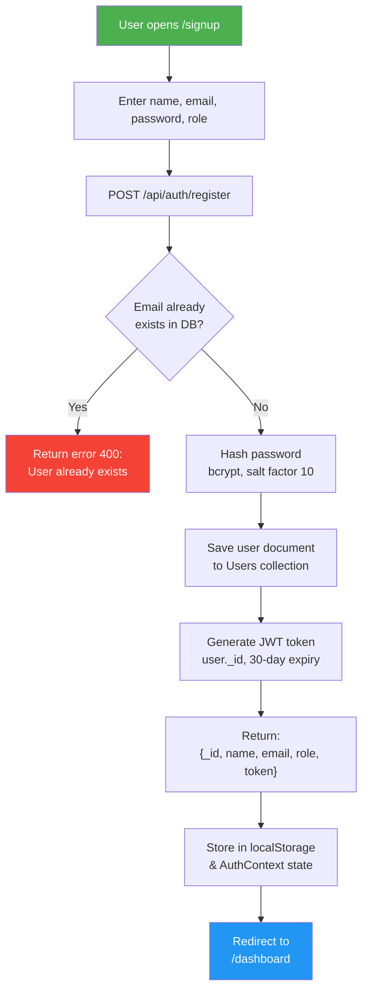
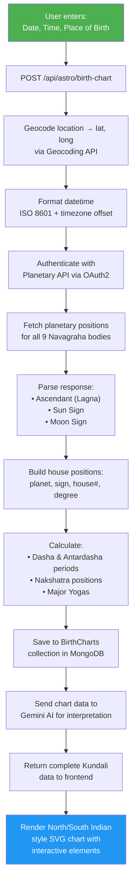
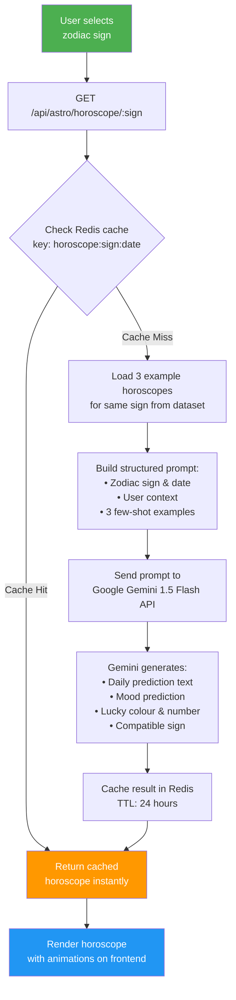
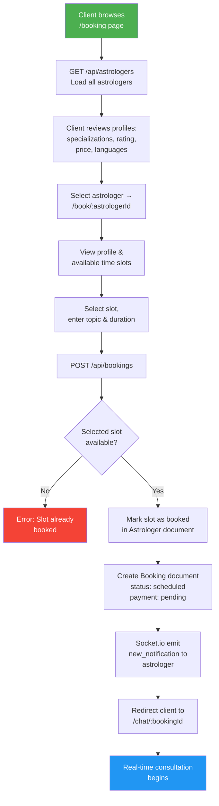
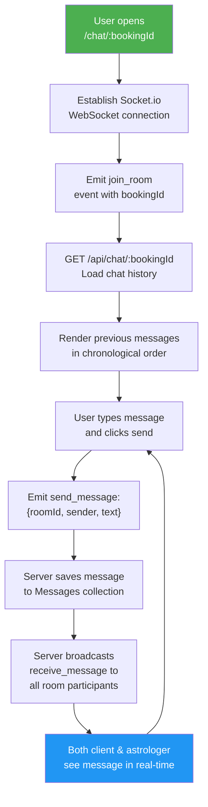
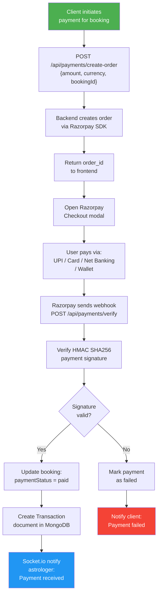
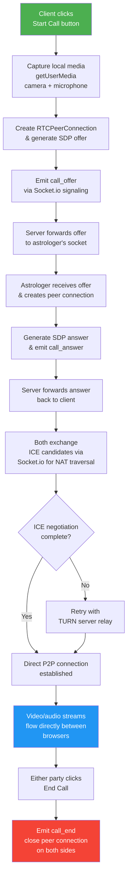
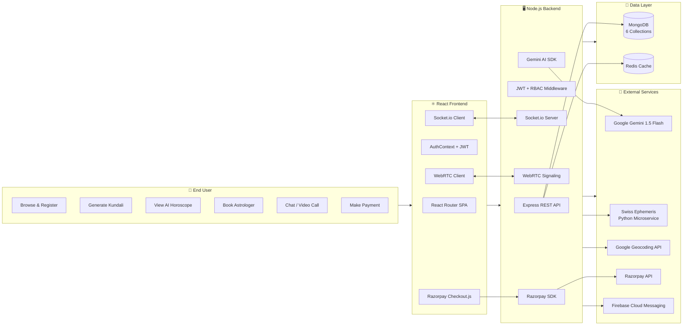

# Research Paper — Advantage Tables & Workflow Diagrams

---

## TABLE I: ADVANTAGES OF THE PROPOSED SYSTEM

| # | Advantage | Description |
|---|---|---|
| 1 | AI-Powered Personalization | Google Gemini 1.5 Flash generates unique horoscopes personalized to each user's birth chart using few-shot prompting, unlike static template-based predictions in existing systems |
| 2 | Accurate Kundali Computation | Swiss Ephemeris engine provides planetary positions accurate to ± 0.01°, matching professional desktop software quality in a web-accessible format |
| 3 | Real-Time Consultation | Socket.io enables instant text chat between clients and astrologers with zero page refresh, creating a seamless consultation experience |
| 4 | Video & Voice Calling | WebRTC enables peer-to-peer video/voice consultations directly in the browser without third-party apps like Zoom or Google Meet |
| 5 | Role-Based Dual Dashboard | Separate dashboards for clients (bookings, reports, birth details) and astrologers (earnings, availability, session management) in a single unified platform |
| 6 | Secure Authentication | JWT token-based stateless authentication with bcrypt password hashing ensures secure access without server-side session overhead |
| 7 | Automated Payment Processing | Razorpay integration supports UPI, cards, net banking, and wallets with webhook-based verification for secure, automated payment handling |
| 8 | High Performance Caching | Redis caches frequently accessed data (horoscopes, astrologer listings) reducing database load and API response times during high traffic |
| 9 | Push Notifications | Firebase Cloud Messaging delivers real-time alerts for bookings, payments, and chat messages across web and mobile platforms |
| 10 | Responsive Single-Page Application | React SPA with client-side routing provides desktop-like speed and mobile-responsive design without full page reloads |
| 11 | Scalable Architecture | Modular Node.js microservice design allows independent scaling of Kundali computation, AI generation, and chat services |
| 12 | Open-Source & Extensible | Full-stack open-source codebase allows community contributions, customization, and academic reproducibility |

---

## TABLE II: ADVANTAGES OVER EXISTING SYSTEMS

| Feature | Traditional Astrology Websites | Mobile Apps (Co-Star, AstroSage) | Proposed System |
|---|---|---|---|
| Horoscope Generation | Static pre-written templates | Rule-based or static templates | AI-generated via Gemini 1.5 Flash with few-shot learning |
| Kundali Accuracy | Basic calculations, limited precision | Moderate accuracy | Swiss Ephemeris with ± 0.01° precision |
| Astrologer Consultation | Phone/email only | In-app chat (limited) | Real-time text chat + video/voice call (WebRTC) |
| Payment Integration | Manual bank transfer | In-app purchase only | Multi-mode: UPI, cards, net banking, wallets (Razorpay) |
| Astrologer Management | No dashboard | No dashboard | Full dashboard with earnings, bookings, availability management |
| Blog/Content Platform | Separate blog site | No blog | Integrated blog with optional AI-assisted writing |
| Personalization Level | Generic (sign-based only) | Moderate (birth chart) | Deep (birth chart + AI interpretation + few-shot context) |
| Notification System | Email only | In-app only | Multi-channel: in-app + push (FCM) + real-time (Socket.io) |
| Performance Optimization | No caching | Minimal | Redis caching layer for high-traffic data |
| Technology Stack | PHP/WordPress legacy | Native mobile (closed source) | Modern full-stack: React + Node.js + MongoDB (open source) |

---

## TABLE III: SYSTEM MODULE ADVANTAGES

| Module | Advantage | Technical Benefit |
|---|---|---|
| Kundali Generation | Eliminates need for desktop astrology software | Browser-accessible SVG charts with interactive hover and click functionality |
| AI Horoscope | Eliminates manual content writing for daily predictions | Few-shot prompting reduces API cost while maintaining astrological accuracy and style consistency |
| Real-Time Chat | Eliminates delayed email/phone consultations | Sub-second message delivery via WebSocket with persistent message history |
| Booking System | Eliminates manual scheduling conflicts | Automated slot management with real-time availability updates and notification to astrologer |
| Astrologer Dashboard | Centralizes all astrologer operations | Single interface for managing bookings, earnings analytics, profile, and availability |
| Payment Gateway | Eliminates manual payment tracking and confirmation | Automated webhook-based verification with transaction records and payout tracking |

---

## TABLE IV: PERFORMANCE ADVANTAGES WITH REDIS CACHING

| Data Type | Without Redis | With Redis | Improvement |
|---|---|---|---|
| Daily Horoscope | MongoDB query + Gemini API call (~2-3 seconds) | Redis cache hit (~5-10 ms) | ~99% faster for cached requests |
| Astrologer List | MongoDB query with population (~200-500 ms) | Redis cache hit (~5-10 ms) | ~95% faster for repeated requests |
| Birth Chart (same inputs) | Geocoding + Ephemeris + MongoDB save (~3-5 seconds) | Redis cache hit (~5-10 ms) | ~99% faster for duplicate calculations |
| Compatibility Check | MongoDB query (~100-200 ms) | Redis cache hit (~5-10 ms) | ~90% faster for popular sign pairs |

---

## TABLE V: SECURITY ADVANTAGES

| Security Concern | Traditional Approach | Proposed System Approach | Advantage |
|---|---|---|---|
| Password Storage | Plain text or MD5 hashing | bcrypt with work factor 10 | Resistant to rainbow table and brute-force attacks |
| Session Management | Server-side sessions (memory intensive) | Stateless JWT tokens (30-day expiry) | No server memory overhead, horizontally scalable |
| Access Control | Simple login/logout | Role-based middleware (client/astrologer) | Granular permission control per API endpoint |
| API Security | No CORS protection | CORS middleware + origin filtering | Prevents unauthorized cross-origin API access |
| Payment Verification | Manual confirmation | HMAC SHA256 webhook signature verification | Tamper-proof automated payment validation |
| Data Encryption | No encryption | AES-256 at rest + TLS 1.3 in transit | End-to-end protection of personal and financial data |

---

## WORKFLOW DIAGRAMS

### Workflow 1: User Registration & Authentication

---

### Workflow 2: Kundali (Birth Chart) Generation

---

### Workflow 3: AI Horoscope Generation (Few-Shot Prompting)

---

### Workflow 4: Astrologer Booking & Consultation

---

### Workflow 5: Real-Time Chat Communication

---

### Workflow 6: Razorpay Payment Processing

---

### Workflow 7: WebRTC Video/Voice Call

---

### Workflow 8: Overall System Architecture Flow

