# AI-Enabled Vedic Astrology Web System — Complete Technical Documentation

> **For Research Paper Use** — This document covers the full system architecture, technology stack, frontend & backend design, database schema, API specification, real-time communication, authentication flow, and user workflows.

---

## 1. System Overview

The **AI-Enabled Vedic Astrology Web System** is a full-stack web application that provides AI-powered astrological services including Kundali (birth chart) generation, daily horoscopes, zodiac compatibility analysis, and live astrologer consultations via real-time chat. The system follows a **client-server architecture** with a React-based Single Page Application (SPA) on the frontend and a Node.js RESTful API server on the backend, connected to a MongoDB NoSQL database.

### 1.1 High-Level Architecture

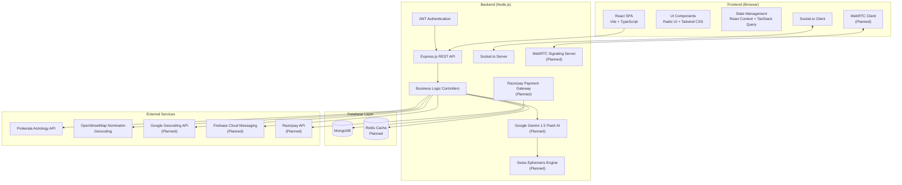

---

## 2. Technology Stack

### 2.1 Frontend Technologies

| Technology | Version | Purpose |
|---|---|---|
| **React** | 18.3.1 | UI library for building component-based interfaces |
| **TypeScript** | 5.8.3 | Static type checking for JavaScript |
| **Vite** | 5.4.19 | Build tool and development server (HMR) |
| **React Router DOM** | 6.30.1 | Client-side routing and navigation |
| **TanStack React Query** | 5.83.0 | Server state management, caching, and synchronization |
| **Tailwind CSS** | 3.4.17 | Utility-first CSS framework for styling |
| **Radix UI** | Various | Accessible, unstyled UI primitives (Dialog, Dropdown, Tabs, etc.) |
| **Framer Motion** | 12.31.0 | Declarative animations and page transitions |
| **Lucide React** | 0.462.0 | Icon library |
| **Socket.io Client** | 4.8.3 | Real-time WebSocket communication |
| **Recharts** | 2.15.4 | Chart and data visualization library |
| **Zod** | 3.25.76 | Schema validation for form inputs |
| **React Hook Form** | 7.61.1 | Performant form handling |
| **Sonner** | 1.7.4 | Toast notification system |

### 2.2 Backend Technologies

| Technology | Version | Purpose |
|---|---|---|
| **Node.js** | Runtime | Server-side JavaScript execution environment |
| **Express.js** | 4.19.2 | Minimal web framework for REST API |
| **MongoDB** | Cloud | NoSQL document database |
| **Mongoose** | 8.4.0 | MongoDB ODM (Object Data Modeling) |
| **Socket.io** | 4.7.5 | Bidirectional real-time event-based communication |
| **JSON Web Token (JWT)** | 9.0.2 | Stateless token-based authentication |
| **bcrypt.js** | 2.4.3 | Password hashing using bcrypt algorithm |
| **dotenv** | 16.4.5 | Environment variable management |
| **CORS** | 2.8.5 | Cross-Origin Resource Sharing middleware |

### 2.3 External APIs (Currently Integrated)

| Service | Purpose |
|---|---|
| **Prokerala Astrology API** | Fetching planetary positions, Rasi data, and Vedic astrology calculations |
| **OpenStreetMap Nominatim** | Free geocoding — converting location names to latitude/longitude coordinates |

### 2.4 Planned Technologies (To Be Integrated)

The following technologies are planned for integration to achieve the full system architecture:

| Technology | Category | Purpose |
|---|---|---|
| **Google Gemini 1.5 Flash AI** | AI/ML | AI-powered personalized horoscope generation, natural language astrological interpretations, and intelligent chatbot responses |
| **Swiss Ephemeris (Python)** | Astrological Engine | High-precision astronomical calculations for planetary positions, house systems, and Dasha periods using a Python microservice |
| **WebRTC** | Real-Time Communication | Peer-to-peer video and voice calling between clients and astrologers for live consultations |
| **Razorpay Payment Gateway** | Payments | Secure online payment processing for booking consultations (UPI, cards, net banking, wallets) |
| **Redis** | Caching | In-memory data store for caching frequently accessed data (horoscopes, astrologer listings) and session management |
| **Firebase Cloud Messaging (FCM)** | Push Notifications | Cross-platform push notifications for booking confirmations, chat messages, and payment alerts |
| **Google Geocoding API** | Geolocation | Premium geocoding service as an upgrade from Nominatim for more accurate location resolution |

---

## 3. Frontend Architecture

### 3.1 Project Structure

```
src/
├── App.tsx                    # Root component with route definitions
├── main.tsx                   # Application entry point
├── index.css                  # Global styles and design tokens
├── context/
│   └── AuthContext.tsx         # Authentication state (login, register, logout)
├── components/
│   ├── Navbar.tsx              # Responsive navigation bar
│   ├── Footer.tsx              # Site footer with links
│   ├── Layout.tsx              # Page layout wrapper
│   ├── MobileBottomNav.tsx     # Mobile bottom navigation bar
│   ├── ProtectedRoute.tsx      # Route guard for authenticated pages
│   ├── LocationInput.tsx       # Autocomplete location input component
│   ├── StarfieldBackground.tsx # Animated starfield canvas background
│   ├── NavLink.tsx             # Styled navigation link component
│   ├── home/                   # Home page section components
│   ├── booking/                # Booking-related components
│   ├── chat/                   # Chat interface components
│   └── ui/                     # Reusable UI primitives (Button, Card, Dialog, etc.)
├── pages/
│   ├── Index.tsx               # Landing / Home page
│   ├── Horoscope.tsx           # Daily horoscope by zodiac sign
│   ├── BirthChart.tsx          # Kundali / Birth chart generator
│   ├── Compatibility.tsx       # Zodiac compatibility checker
│   ├── Booking.tsx             # Astrologer listing for booking
│   ├── BookingPage.tsx         # Detailed booking flow for a specific astrologer
│   ├── Chat.tsx                # Real-time chat with astrologer
│   ├── Blog.tsx                # Blog listing page
│   ├── BlogPost.tsx            # Individual blog post view
│   ├── Dashboard.tsx           # User dashboard (bookings, reports, birth details)
│   ├── Login.tsx               # User login form
│   ├── Signup.tsx              # User registration form
│   ├── Contact.tsx             # Contact form
│   ├── PrivacyPolicy.tsx       # Privacy policy page
│   ├── TermsOfService.tsx      # Terms of service page
│   ├── NotFound.tsx            # 404 error page
│   └── astrologer/
│       ├── Dashboard.tsx       # Astrologer dashboard (stats, earnings, sessions)
│       ├── Bookings.tsx        # Manage incoming bookings
│       ├── Availability.tsx    # Set availability slots
│       ├── Earnings.tsx        # View earnings and payouts
│       ├── EditProfile.tsx     # Edit astrologer profile
│       └── NotificationSettings.tsx # Manage notification preferences
├── hooks/                      # Custom React hooks
├── lib/                        # Utility functions
└── test/                       # Unit tests (Vitest)
```

### 3.2 Routing Architecture

The application uses **React Router v6** with nested routes and route protection.

```mermaid
graph TD
    Root["/"] --> Public["Public Routes"]
    Root --> Protected["Protected Routes<br/>(Requires Login)"]

    Public --> Home["/ — Home Page"]
    Public --> Horoscope["/horoscope — Daily Horoscope"]
    Public --> BirthChart["/birth-chart — Kundali Generator"]
    Public --> Compatibility["/compatibility — Zodiac Match"]
    Public --> Blog["/blog — Blog Listing"]
    Public --> BlogSlug["/blog/:slug — Blog Post"]
    Public --> Contact["/contact — Contact"]
    Public --> Login["/login — Login"]
    Public --> Signup["/signup — Register"]
    Public --> Privacy["/privacy — Privacy Policy"]
    Public --> Terms["/terms — Terms of Service"]

    Protected --> Dashboard["/dashboard — User Dashboard"]
    Protected --> Chat["/chat — Chat"]
    Protected --> ChatRoom["/chat/:bookingId — Chat Room"]
    Protected --> Booking["/booking — Browse Astrologers"]
    Protected --> BookAnAstrologer["/book/:astrologerId — Book Session"]

    Protected --> AstrologerDash["/astrologer/dashboard"]
    Protected --> AstrologerAvail["/astrologer/availability"]
    Protected --> AstrologerBook["/astrologer/bookings"]
    Protected --> AstrologerEarn["/astrologer/earnings"]
    Protected --> AstrologerEdit["/astrologer/edit-profile"]
    Protected --> AstrologerNotif["/astrologer/notifications"]
```

### 3.3 Authentication State Management

Authentication is managed via **React Context API** (`AuthContext.tsx`):

- **State**: Stores the logged-in `User` object (id, name, email, role, JWT token) in React state and `localStorage`.
- **Login**: Sends `POST /api/auth/login` → receives `{ _id, name, email, role, token }` → stores in `localStorage` → navigates to `/dashboard`.
- **Register**: Sends `POST /api/auth/register` → same response → auto-login after registration.
- **Logout**: Clears `localStorage` → sets user state to `null` → redirects to `/login`.
- **Persistence**: On page load, reads `localStorage('userInfo')` to restore session.

### 3.4 Route Protection

The `ProtectedRoute` component wraps all authenticated routes. It checks `AuthContext` for a logged-in user and redirects unauthenticated visitors to `/login`.

---

## 4. Backend Architecture

### 4.1 Project Structure

```
backend/
├── server.js                   # Entry point — Express + Socket.io setup
├── config/
│   └── db.js                   # MongoDB connection using Mongoose
├── middleware/
│   └── authMiddleware.js       # JWT verification + role-based authorization
├── models/
│   ├── User.js                 # User schema (client & astrologer)
│   ├── Astrologer.js           # Astrologer profile schema
│   ├── Booking.js              # Booking/appointment schema
│   ├── BirthChart.js           # Generated birth chart data schema
│   ├── Message.js              # Chat message schema
│   └── Report.js               # Astrological report schema
├── controllers/
│   ├── authController.js       # Register & Login logic
│   ├── userController.js       # User profile, birth details, reports
│   ├── astrologerController.js # Astrologer CRUD, dashboard, earnings
│   ├── bookingController.js    # Booking creation, status, payments
│   ├── astroController.js      # Horoscope, compatibility, birth chart
│   ├── chatController.js       # Chat history retrieval
│   └── horoscopeController.js  # (Placeholder — reserved for AI horoscope)
├── routes/
│   ├── authRoutes.js           # POST /api/auth/register, /api/auth/login
│   ├── userRoutes.js           # GET /api/users/profile, /birth-details, /reports, /chats
│   ├── astrologerRoutes.js     # GET/PUT /api/astrologers/*
│   ├── bookingRoutes.js        # POST/GET/PUT/PATCH /api/bookings/*
│   ├── astroRoutes.js          # GET/POST /api/astro/horoscope, /compatibility, /birth-chart
│   ├── chatRoutes.js           # GET /api/chat/:bookingId
│   └── horoscopeRoutes.js      # (Placeholder)
├── socket/
│   └── socket.js               # Socket.io event handlers (modular)
└── .env                        # Environment variables (secrets)
```

### 4.2 Server Initialization Flow

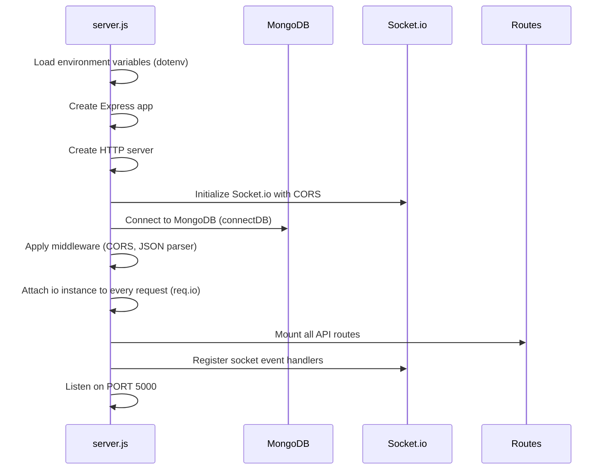

### 4.3 Middleware Pipeline

Every incoming HTTP request passes through:

1. **CORS Middleware** — Allows cross-origin requests from the frontend
2. **JSON Body Parser** — Parses `application/json` request bodies
3. **Socket.io Injector** — Attaches `io` instance to `req.io` for real-time notifications
4. **Route Handler** — Matched to a specific route
5. **Auth Middleware** (protected routes only):
   - `protect` — Extracts JWT from `Authorization: Bearer <token>`, verifies it, attaches `req.user`
   - `authorize(roles...)` — Checks `req.user.role` against allowed roles (e.g., `'client'`, `'astrologer'`)

---

## 5. Database Schema Design

The system uses **MongoDB** with **Mongoose ODM**. Below is the Entity-Relationship diagram and schema details.

### 5.1 Entity-Relationship Diagram

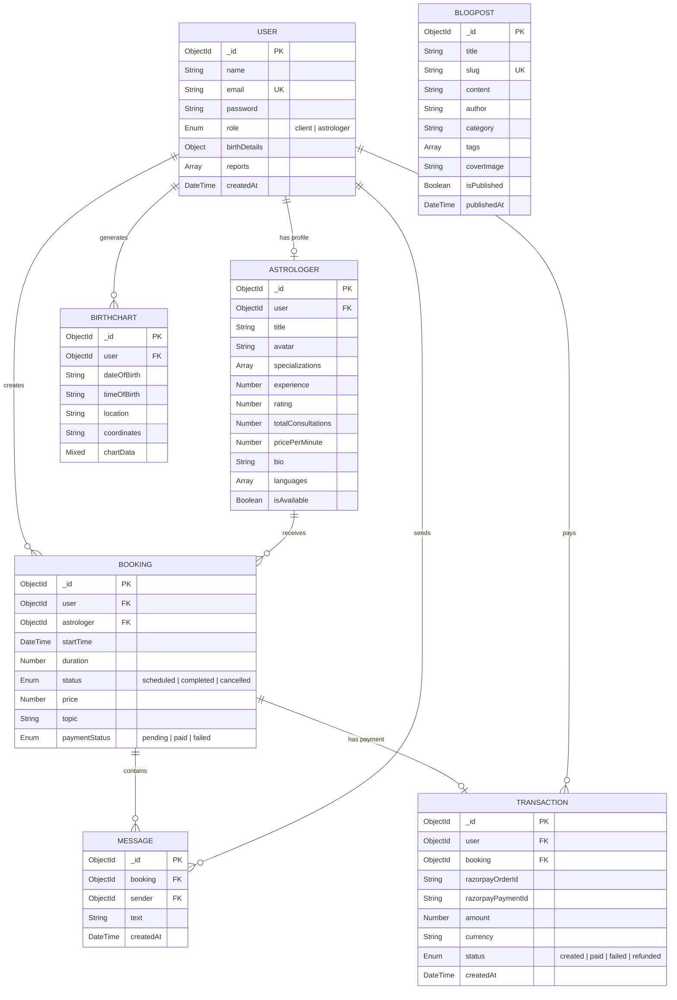

### 5.2 Schema Details

#### User Schema
- **Password Security**: Passwords are hashed using **bcrypt** (salt rounds: 10) via a Mongoose `pre('save')` hook. Plaintext passwords are never stored.
- **Role-Based Access**: Each user has a `role` field (`client` or `astrologer`) that determines their access level.
- **Birth Details**: Embedded sub-document storing date of birth, time, and place for astrological calculations.
- **Reports**: Embedded array of generated astrological report references.

#### Astrologer Schema
- References `User` via `ObjectId` (one-to-one relationship).
- Contains professional details: specializations (e.g., "Vedic Astrology", "Tarot"), years of experience, consultation pricing, bio, and spoken languages.
- `isAvailable` flag controls online/offline status.

#### Booking Schema
- Links a `User` (client) to an `Astrologer` for a scheduled consultation.
- Tracks session `duration` (minutes), `price`, `topic`, booking `status`, and `paymentStatus`.

#### Message Schema
- Each message belongs to a `Booking` (chat room) and has a `sender` (User reference).
- Messages are sorted chronologically via `createdAt` timestamps.

#### BirthChart Schema
- Stores generated Kundali data with the input parameters (date, time, location, coordinates).
- `chartData` is a Mixed/flexible field storing the complete planetary position data from the Prokerala API including ascendant, sun sign, moon sign, and house positions.

---

## 6. REST API Specification

### 6.1 Authentication APIs

| Method | Endpoint | Access | Description |
|---|---|---|---|
| `POST` | `/api/auth/register` | Public | Register a new user (client or astrologer) |
| `POST` | `/api/auth/login` | Public | Login and receive JWT token |

**Register Request Body:**
```json
{ "name": "string", "email": "string", "password": "string", "role": "client|astrologer" }
```

**Login Response:**
```json
{ "_id": "ObjectId", "name": "string", "email": "string", "role": "string", "token": "JWT" }
```

### 6.2 User APIs

| Method | Endpoint | Access | Description |
|---|---|---|---|
| `GET` | `/api/users/profile` | Private | Get logged-in user's profile |
| `GET` | `/api/users/birth-details` | Private | Get saved birth details |
| `GET` | `/api/users/reports` | Private | Get generated astrological reports |
| `GET` | `/api/users/chats` | Private | Get chat history overview |

### 6.3 Astrologer APIs

| Method | Endpoint | Access | Description |
|---|---|---|---|
| `GET` | `/api/astrologers` | Public | List all astrologers |
| `GET` | `/api/astrologers/:id` | Public | Get astrologer by ID |
| `GET` | `/api/astrologers/me` | Astrologer | Get own profile |
| `PUT` | `/api/astrologers/profile` | Astrologer | Update profile details |
| `GET` | `/api/astrologers/dashboard` | Astrologer | Get dashboard statistics |
| `GET` | `/api/astrologers/earnings` | Astrologer | Get earnings breakdown |
| `PUT` | `/api/astrologers/availability` | Astrologer | Toggle online/offline status |
| `POST` | `/api/astrologers/availability/slots` | Astrologer | Set available time slots |

### 6.4 Booking APIs

| Method | Endpoint | Access | Description |
|---|---|---|---|
| `POST` | `/api/bookings` | Client | Create a new booking |
| `GET` | `/api/bookings/user` | Private | Get user's bookings |
| `GET` | `/api/bookings/astrologer` | Private | Get astrologer's bookings |
| `PUT` | `/api/bookings/:id/status` | Private | Update booking status |
| `PATCH` | `/api/bookings/:id/pay` | Private | Mark booking as paid |

### 6.5 Astrology APIs

| Method | Endpoint | Access | Description |
|---|---|---|---|
| `GET` | `/api/astro/horoscope/:sign` | Public | Get daily horoscope for a zodiac sign |
| `POST` | `/api/astro/compatibility` | Public | Get compatibility between two signs |
| `POST` | `/api/astro/birth-chart` | Public | Generate Kundali / birth chart |

### 6.6 Chat APIs

| Method | Endpoint | Access | Description |
|---|---|---|---|
| `GET` | `/api/chat/:bookingId` | Private | Get chat messages for a booking |

---

## 7. Real-Time Communication (Socket.io)

The application uses **Socket.io** for bidirectional real-time communication between the client and server.

### 7.1 Socket Events

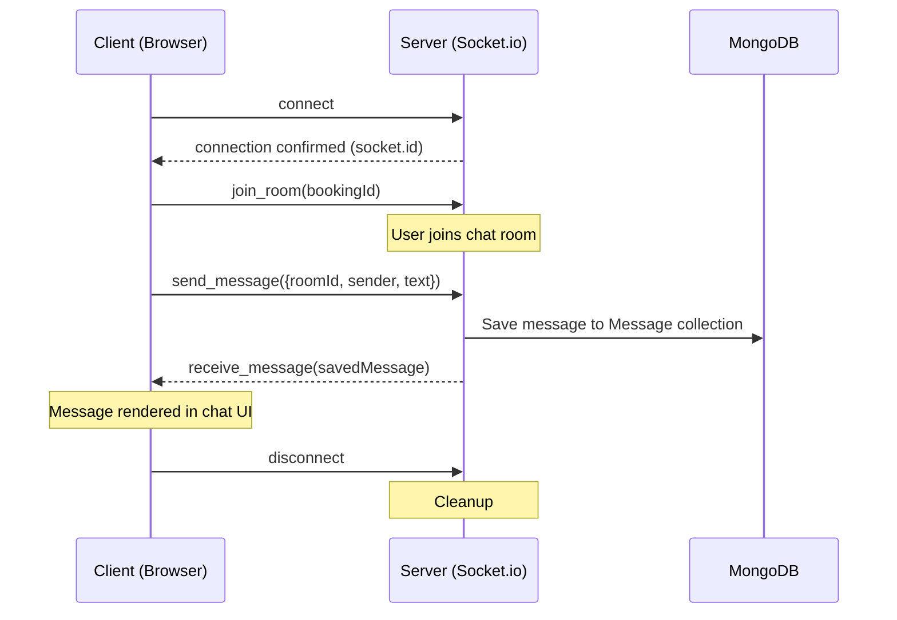

### 7.2 Real-Time Notifications

The server also emits notifications to specific users (astrologers) for:
- **New Booking**: When a client books a session, the astrologer receives a real-time `new_notification` event.
- **Payment Received**: When a client marks a booking as paid, the astrologer is notified via socket.

---

## 8. Key User Workflows

### 8.1 User Registration & Login Flow

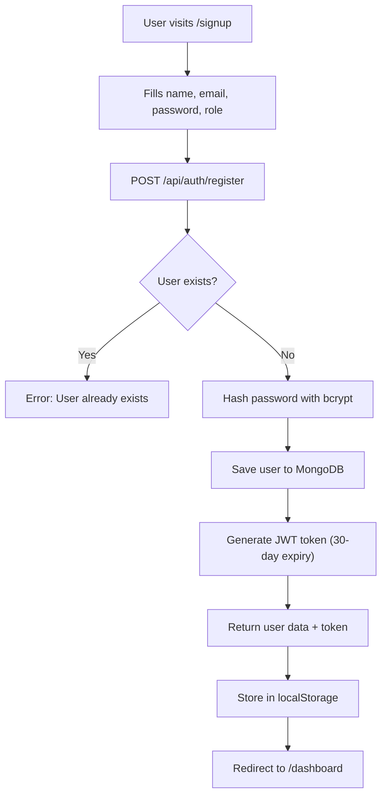

### 8.2 Birth Chart (Kundali) Generation Flow

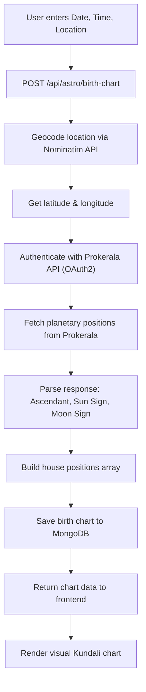

### 8.3 Astrologer Consultation Booking Flow

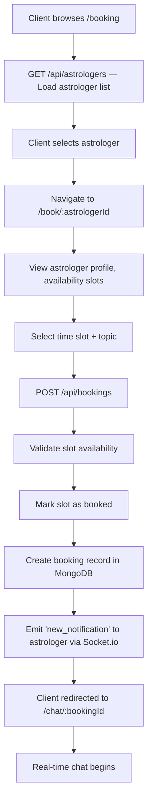

### 8.4 Real-Time Chat Flow

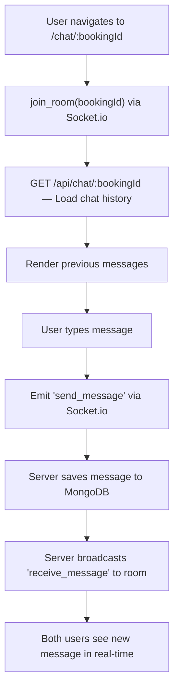

### 8.5 Horoscope Retrieval Flow

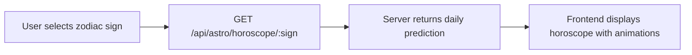

### 8.6 Zodiac Compatibility Check Flow

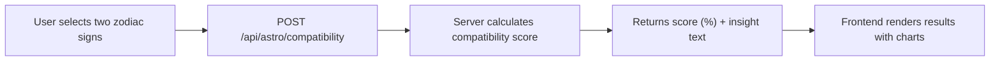

---

## 9. Authentication & Security Architecture

### 9.1 JWT Authentication Flow

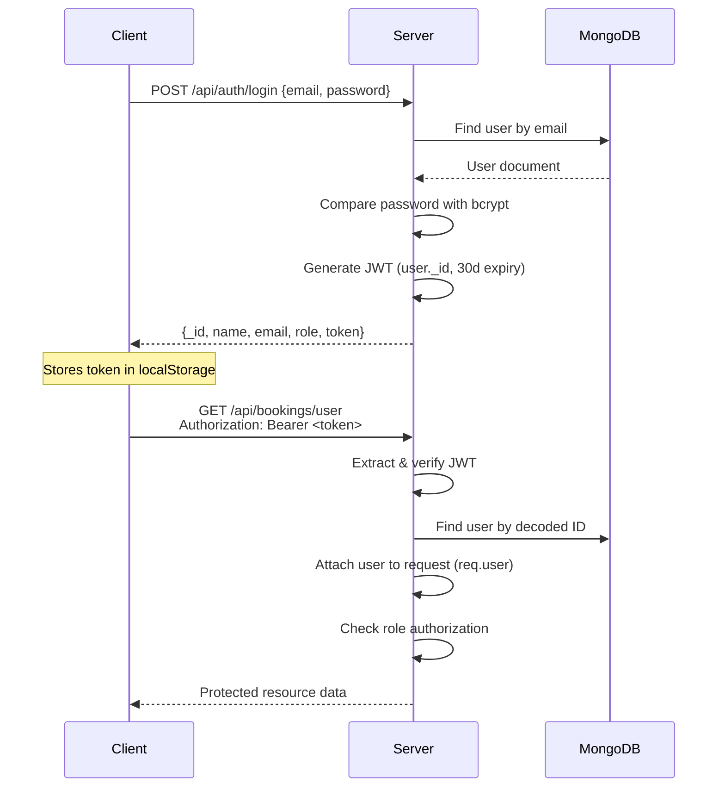

### 9.2 Security Measures

| Measure | Implementation |
|---|---|
| **Password Hashing** | bcrypt with 10 salt rounds |
| **Token-Based Auth** | JWT with 30-day expiration |
| **Role-Based Access Control** | `authorize()` middleware checks user role before granting access |
| **CORS** | Configured to control cross-origin requests |
| **Protected Routes** | Client-side `ProtectedRoute` component + server-side `protect` middleware |

---

## 10. Deployment Architecture

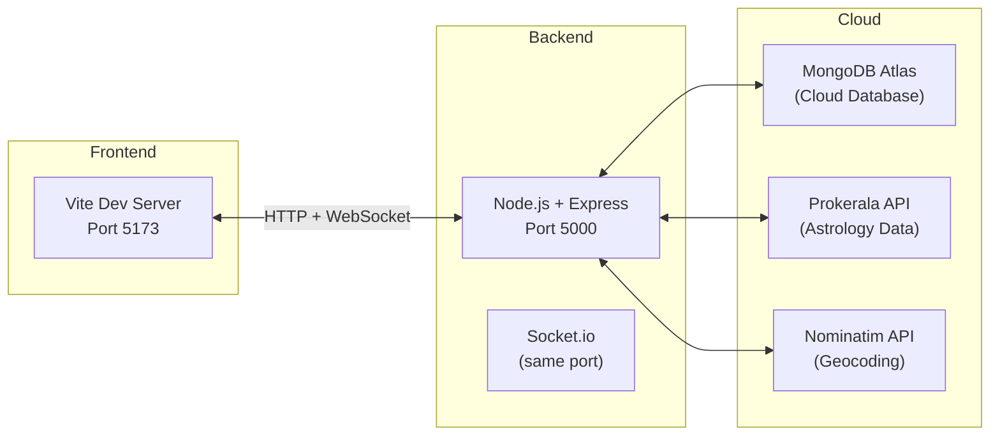

| Component | Port | Description |
|---|---|---|
| Frontend (Vite) | 5173 | React development server with Hot Module Replacement |
| Backend (Express) | 5000 | REST API + Socket.io server |
| MongoDB Atlas | Cloud | Hosted NoSQL database |

---

## 11. Module-Wise Feature Summary

### 11.1 Public Features (No Login Required)

| Feature | Frontend Page | Backend Endpoint | Description |
|---|---|---|---|
| Home / Landing | `Index.tsx` | — | Hero section, features, call-to-action |
| Daily Horoscope | `Horoscope.tsx` | `GET /api/astro/horoscope/:sign` | Browse 12 zodiac signs and view daily predictions |
| Birth Chart | `BirthChart.tsx` | `POST /api/astro/birth-chart` | Generate Kundali using date, time, and location |
| Compatibility | `Compatibility.tsx` | `POST /api/astro/compatibility` | Check zodiac compatibility between two signs |
| Blog | `Blog.tsx`, `BlogPost.tsx` | — | Read astrology articles and guides |
| Contact | `Contact.tsx` | — | Contact form |
| Browse Astrologers | `Booking.tsx` | `GET /api/astrologers` | View all available astrologers |

### 11.2 Client Features (Login Required)

| Feature | Frontend Page | Backend Endpoint | Description |
|---|---|---|---|
| Dashboard | `Dashboard.tsx` | `GET /api/users/profile`, `/birth-details`, `/reports` | View profile, saved charts, reports, bookings |
| Book Astrologer | `BookingPage.tsx` | `POST /api/bookings` | Book a consultation with a specific astrologer |
| Chat | `Chat.tsx` | `GET /api/chat/:bookingId` + Socket.io | Real-time text chat during consultation |
| Payment | — | `PATCH /api/bookings/:id/pay` | Mark booking as paid |

### 11.3 Astrologer Features (Astrologer Role Required)

| Feature | Frontend Page | Backend Endpoint | Description |
|---|---|---|---|
| Dashboard | `astrologer/Dashboard.tsx` | `GET /api/astrologers/dashboard` | View stats: bookings, earnings, sessions today |
| Manage Bookings | `astrologer/Bookings.tsx` | `GET /api/bookings/astrologer` | View and manage client bookings |
| Set Availability | `astrologer/Availability.tsx` | `POST /api/astrologers/availability/slots` | Define available time slots |
| View Earnings | `astrologer/Earnings.tsx` | `GET /api/astrologers/earnings` | Track total, monthly, and pending earnings |
| Edit Profile | `astrologer/EditProfile.tsx` | `PUT /api/astrologers/profile` | Update bio, specializations, pricing, languages |
| Notifications | `astrologer/NotificationSettings.tsx` | — | Configure notification preferences |

---

## 12. Data Flow Summary

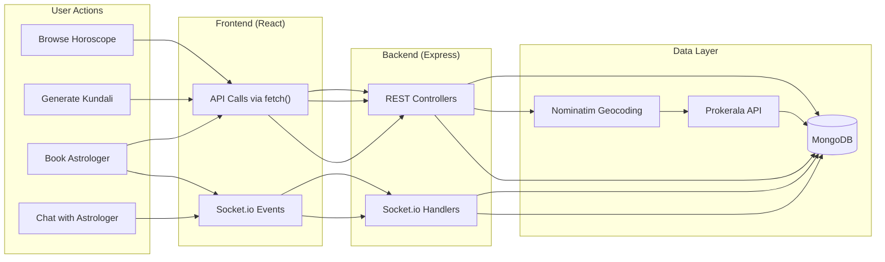

---

## 13. Environment Configuration

The backend requires the following environment variables (`.env`):

| Variable | Description |
|---|---|
| `PORT` | Server port (default: 5000) |
| `MONGO_URI` | MongoDB connection string |
| `JWT_SECRET` | Secret key for JWT signing |
| `ASTRO_CLIENT_ID` | Prokerala API client ID |
| `ASTRO_CLIENT_SECRET` | Prokerala API client secret |

---

## 14. Proposed Enhancements & Planned Features

The following modules are planned for integration to complete the full system architecture as envisioned in the design phase.

### 14.1 Google Gemini 1.5 Flash AI Integration

**Purpose**: Replace static/mock horoscope data with AI-generated personalized predictions.

**Planned Implementation**:
- Integrate Google Gemini 1.5 Flash API via `@google/generative-ai` SDK
- Generate personalized daily, weekly, and monthly horoscopes based on user's birth chart data
- Provide AI-powered astrological interpretations of planetary positions
- Create an AI chatbot for instant astrological Q&A

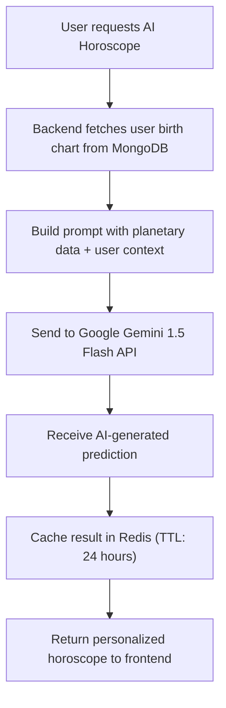

**Planned API Endpoints**:

| Method | Endpoint | Description |
|---|---|---|
| `GET` | `/api/astro/ai-horoscope/:sign` | AI-generated daily horoscope |
| `POST` | `/api/astro/ai-interpretation` | AI interpretation of birth chart |
| `POST` | `/api/astro/ai-chat` | AI chatbot for astrological queries |

### 14.2 Swiss Ephemeris Python Engine

**Purpose**: High-precision astronomical calculations for Vedic astrology (as a complement/replacement to Prokerala API).

**Planned Implementation**:
- Deploy a Python microservice using Flask/FastAPI with the `pyswisseph` library
- Calculate planetary positions, house cusps, Dasha periods, and Yogas with sub-arc accuracy
- Called by the Node.js backend via internal HTTP requests
- Eliminates dependency on third-party API for core astrological computations

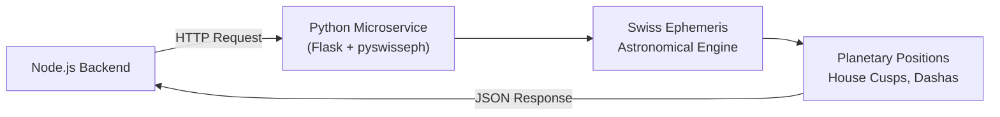

**Planned Calculations**:
- Planet longitudes (Sun, Moon, Mars, Mercury, Jupiter, Venus, Saturn, Rahu, Ketu)
- Ascendant (Lagna) calculation with Ayanamsa correction (Lahiri)
- Bhava (House) chart generation
- Vimshottari Dasha period computation
- Planetary strength (Shadbala) analysis

### 14.3 WebRTC Video & Voice Calling

**Purpose**: Enable live video/voice consultations between clients and astrologers.

**Planned Implementation**:
- WebRTC peer-to-peer connections with Socket.io as the signaling server
- ICE candidate exchange and SDP offer/answer negotiation
- STUN/TURN server configuration for NAT traversal
- Call controls: mute, camera toggle, screen share, end call

```mermaid
sequenceDiagram
    participant Client as Client (Browser)
    participant Signal as Socket.io Signaling Server
    participant Astrologer as Astrologer (Browser)

    Client->>Signal: Initiate call (offer SDP)
    Signal->>Astrologer: Forward call offer
    Astrologer->>Signal: Accept call (answer SDP)
    Signal->>Client: Forward answer

    Client->>Signal: Send ICE candidates
    Signal->>Astrologer: Forward ICE candidates
    Astrologer->>Signal: Send ICE candidates
    Signal->>Client: Forward ICE candidates

    Note over Client,Astrologer: Peer-to-peer connection established
    Client<-->Astrologer: Direct video/audio stream (WebRTC)
```

**Planned Socket Events**:

| Event | Direction | Purpose |
|---|---|---|
| `call_initiate` | Client → Server | Start a video/voice call |
| `call_offer` | Server → Astrologer | Forward SDP offer |
| `call_answer` | Astrologer → Server → Client | Forward SDP answer |
| `ice_candidate` | Bidirectional | Exchange ICE candidates |
| `call_end` | Either → Server → Other | End the call |

### 14.4 Razorpay Payment Gateway

**Purpose**: Secure online payment processing for consultation bookings.

**Planned Implementation**:
- Server-side order creation via Razorpay Node.js SDK
- Client-side payment modal using Razorpay Checkout.js
- Webhook-based payment verification for security
- Support for UPI, credit/debit cards, net banking, and wallets
- Transaction records stored in MongoDB

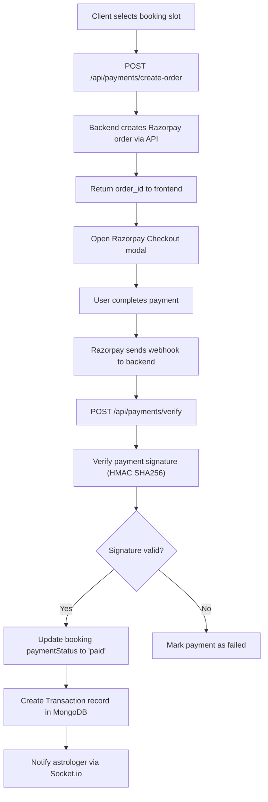

**Planned API Endpoints**:

| Method | Endpoint | Description |
|---|---|---|
| `POST` | `/api/payments/create-order` | Create Razorpay order |
| `POST` | `/api/payments/verify` | Verify payment signature |
| `GET` | `/api/payments/history` | Get user payment history |
| `POST` | `/api/payments/webhook` | Razorpay webhook handler |

**Planned Transaction Model**:

| Field | Type | Description |
|---|---|---|
| `user` | ObjectId (ref: User) | Paying user |
| `booking` | ObjectId (ref: Booking) | Associated booking |
| `razorpayOrderId` | String | Razorpay order ID |
| `razorpayPaymentId` | String | Razorpay payment ID |
| `amount` | Number | Amount in paise (INR) |
| `currency` | String | Currency code (INR) |
| `status` | Enum | created / paid / failed / refunded |

### 14.5 Redis Caching Layer

**Purpose**: Improve performance by caching frequently accessed data.

**Planned Implementation**:
- Use `ioredis` or `redis` npm package
- Cache daily horoscope responses (TTL: 24 hours)
- Cache astrologer listings (TTL: 5 minutes)
- Cache AI-generated predictions to reduce API costs
- Session store for Socket.io (scaling to multiple server instances)

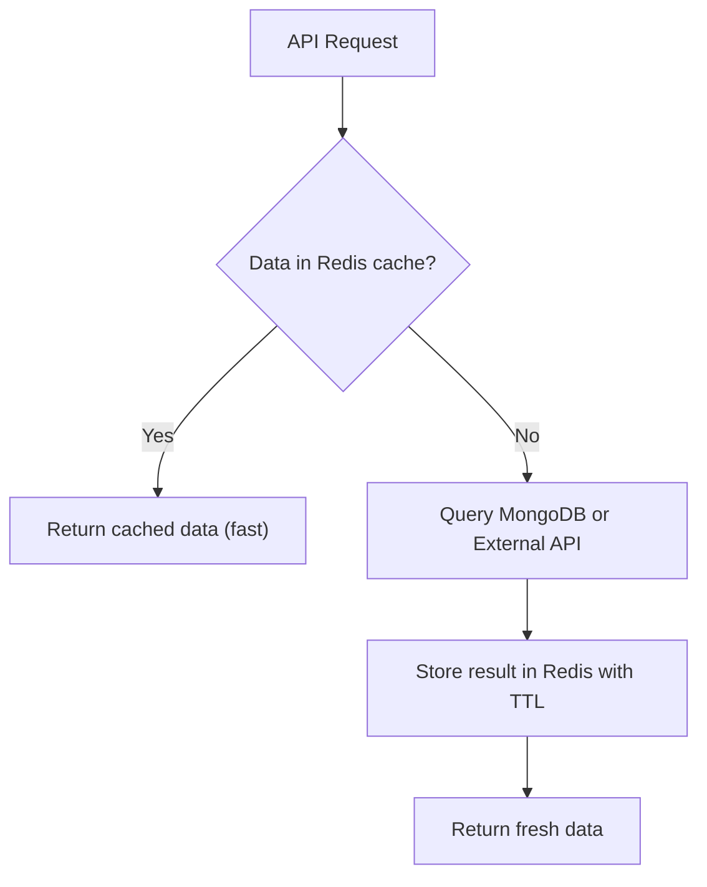

**Planned Cache Keys**:

| Key Pattern | TTL | Data Cached |
|---|---|---|
| `horoscope:{sign}:{date}` | 24 hours | Daily horoscope for each zodiac sign |
| `astrologers:all` | 5 minutes | List of all astrologers |
| `astrologer:{id}` | 10 minutes | Individual astrologer profile |
| `ai-horoscope:{userId}:{date}` | 24 hours | AI-generated personalized horoscope |
| `birthchart:{hash}` | 7 days | Birth chart for same input parameters |

### 14.6 Firebase Cloud Messaging (FCM)

**Purpose**: Send push notifications to users across web and mobile platforms.

**Planned Implementation**:
- Integrate Firebase Admin SDK on the backend
- Register device tokens via Service Worker on the frontend
- Send notifications for: booking confirmations, chat messages, payment receipts, daily horoscope reminders

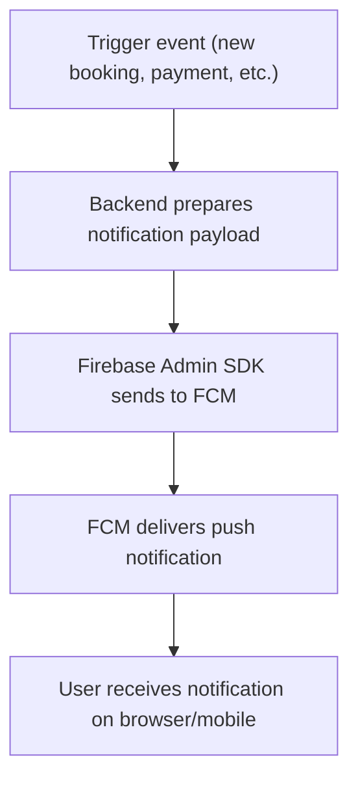

**Planned Notification Types**:

| Event | Recipient | Notification Content |
|---|---|---|
| New Booking | Astrologer | "New booking from {client} for {topic}" |
| Booking Confirmed | Client | "Your session with {astrologer} is confirmed" |
| Payment Received | Astrologer | "Payment of ₹{amount} received for session" |
| Chat Message | Recipient | "{sender}: {message preview}" |
| Daily Horoscope | All subscribed users | "Your daily horoscope is ready!" |
| Session Reminder | Both | "Your session starts in 15 minutes" |

### 14.7 BlogPost Model (Planned)

**Purpose**: Store and manage blog content dynamically from the database instead of static frontmatter.

| Field | Type | Description |
|---|---|---|
| `title` | String | Blog post title |
| `slug` | String (unique) | URL-friendly identifier |
| `content` | String | Full article content (Markdown/HTML) |
| `author` | String | Author name |
| `category` | String | Category (e.g., "Vedic Astrology", "Numerology") |
| `tags` | [String] | Searchable tags |
| `coverImage` | String | Cover image URL |
| `isPublished` | Boolean | Draft/published flag |
| `publishedAt` | DateTime | Publication date |

### 14.8 Planned Architecture Summary

| Component | Current Status | Planned Enhancement |
|---|---|---|
| Horoscope Engine | Static mock data | → Google Gemini AI + Swiss Ephemeris |
| Astro Calculations | Prokerala API (external) | → Swiss Ephemeris (self-hosted Python) |
| Communication | Text chat (Socket.io) | → Video/Voice calls (WebRTC) |
| Payments | Manual status update | → Razorpay automated gateway |
| Caching | No caching | → Redis for API & DB response caching |
| Notifications | In-app only (Socket.io) | → Push notifications (Firebase FCM) |
| Geocoding | Nominatim (free) | → Google Geocoding API (premium accuracy) |
| Blog Storage | Static frontend data | → Dynamic MongoDB BlogPost model |
| Transactions | No separate tracking | → Dedicated Transaction model with Razorpay IDs |

---

## 15. Conclusion

The AI-Enabled Vedic Astrology Web System demonstrates a modern, scalable web application architecture combining:

**Currently Implemented:**
- **React + TypeScript** for a type-safe, component-driven frontend
- **Node.js + Express** for a lightweight, high-performance REST API
- **MongoDB** for flexible document storage suited to varied astrological data structures
- **Socket.io** for real-time bidirectional communication enabling live consultations
- **JWT + bcrypt** for secure, stateless authentication
- **Prokerala Astrology API** for Vedic planetary calculations
- **Role-based access control** separating client and astrologer functionalities

**Planned Enhancements:**
- **Google Gemini 1.5 Flash AI** for intelligent, personalized astrological predictions
- **Swiss Ephemeris Python Engine** for self-hosted, high-precision astronomical computations
- **WebRTC** for peer-to-peer video/voice consultation capabilities
- **Razorpay Payment Gateway** for secure, automated payment processing
- **Redis** for high-performance caching and reduced API response times
- **Firebase Cloud Messaging** for cross-platform push notifications

The system serves as a bridge between traditional Vedic astrological knowledge and modern web technologies, providing users with accessible, real-time astrological services through an intuitive digital interface. The planned enhancements will further elevate the platform by introducing AI-driven intelligence, multimedia consultations, automated payments, and performance optimizations — transforming it into a comprehensive, production-ready astrology platform.
